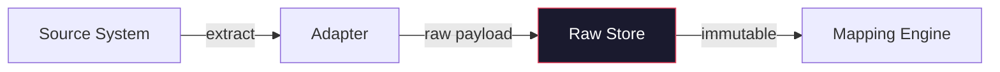
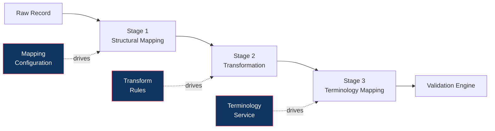
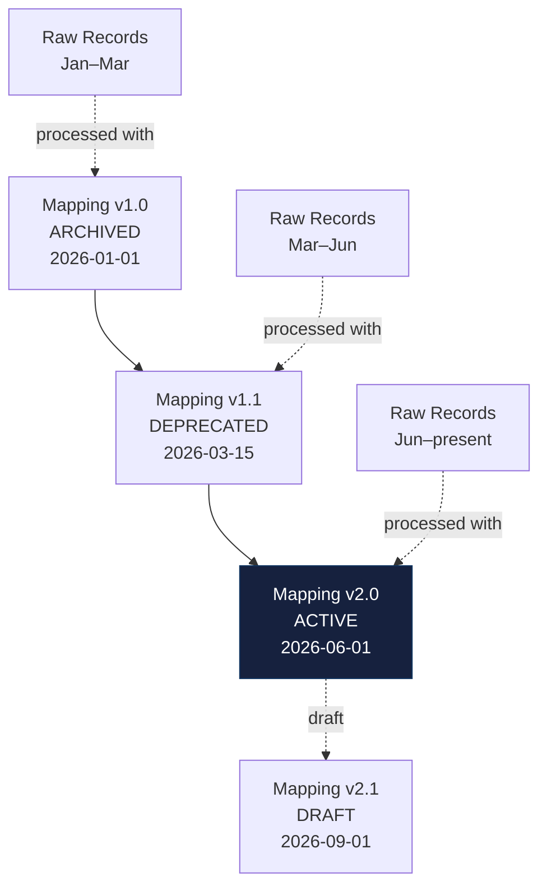
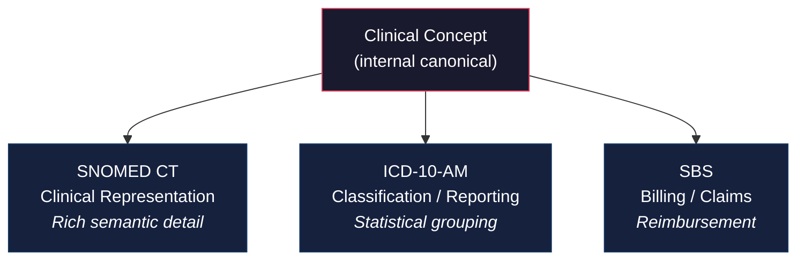
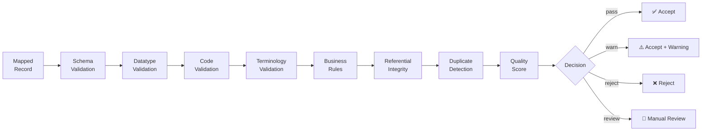
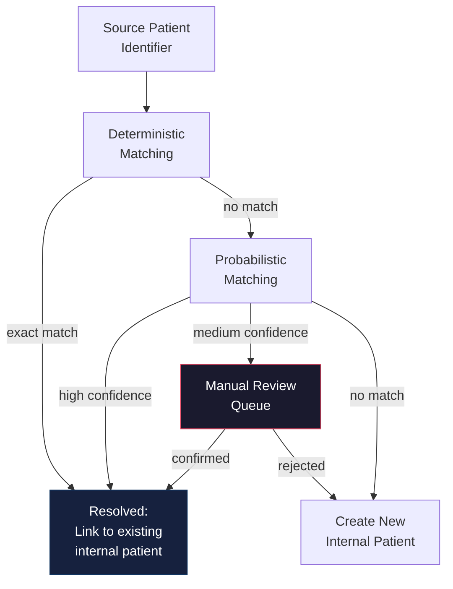
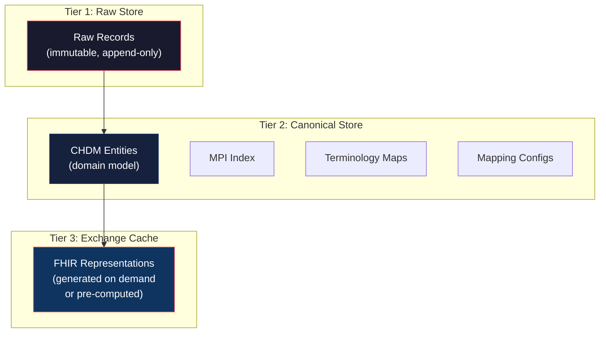
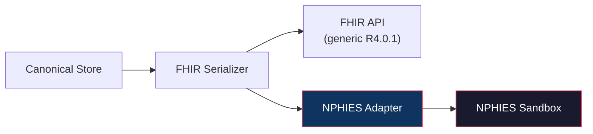
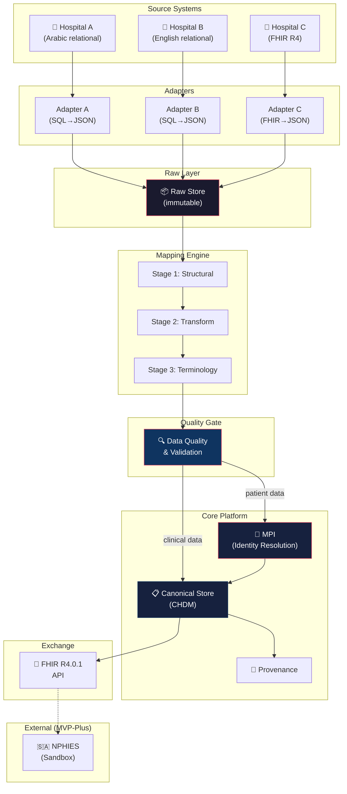

# Architecture Revision v0.2 — Saudi National Health Interoperability Platform

---

## 1. Executive Summary

This document revises the initial Canonical Health Data Model (CHDM v0.1) into a complete **interoperability platform architecture** (v0.2). The fundamental reframing:

| v0.1 Assumption | v0.2 Revision |
|-----------------|---------------|
| FHIR is the canonical internal model | FHIR is the **exchange representation**; CHDM is an independent domain model |
| NPHIES defines the core architecture | NPHIES is an **external integration target** |
| Build a FHIR server | Build a **normalization engine** that can emit FHIR |
| Single source format assumed | **Three heterogeneous source systems** demonstrating normalization |
| Mapping is implicit | **Mapping Engine** is a first-class architectural component |
| Data quality is assumed | **Explicit Data Quality layer** between mapping and persistence |
| MPI conflated with FHIR Patient.id | **Independent MPI** with identity resolution pipeline |

### The Core Problem

Saudi healthcare facilities use heterogeneous hospital information systems with incompatible schemas, identifier formats, local codes, and clinical terminology. The platform must **normalize** these representations into a single canonical model — without requiring source systems to change.

### The Four-Model Boundary

```
Source Model ≠ Canonical Domain Model ≠ FHIR Exchange Model ≠ NPHIES Profiles
```

Each model serves a distinct purpose:

| Model | Purpose | Owned By |
|-------|---------|----------|
| **Source Model** | Native representation of each hospital's HIS | Each facility |
| **Canonical Domain Model (CHDM)** | Normalized internal representation | This platform |
| **FHIR Exchange Model** | Interoperable representation (R4.0.1) | HL7 standard |
| **NPHIES Profiles** | Saudi-specific FHIR profiles for national exchange | CHI / HL7 Saudi |

---

## 2. Architectural Goals

| # | Goal | Measurable Outcome |
|---|------|--------------------|
| G1 | Normalize heterogeneous hospital data into one canonical model | 3 synthetic hospitals → 1 unified patient record |
| G2 | Preserve raw source data for reprocessing and audit | Raw payloads immutable; re-runnable with new mapping versions |
| G3 | Configuration-driven mapping (no hard-coded if/else) | New hospital onboarded via configuration, not code changes |
| G4 | Terminology normalization across clinical, classification, and billing systems | Same concept mapped to SNOMED CT, ICD-10-AM, and SBS simultaneously |
| G5 | Patient identity resolution across facilities | MPI resolves same patient from 3 different MRNs |
| G6 | Data quality as explicit gate before canonical persistence | Records scored, validated, and routed (accept/reject/review) |
| G7 | Full provenance from source to canonical to FHIR | Any canonical record traceable to source record + mapping version |
| G8 | FHIR R4.0.1 as exchange layer (not internal model) | CHDM → FHIR serialization on demand |
| G9 | NPHIES as optional external integration (not prerequisite) | Core MVP functions without NPHIES connectivity |
| G10 | Visible integration monitoring | Dashboard showing source status, record counts, errors |
| G11 | Live Patient Portal & Empowerment | Patient user role fetching real-time canonical data (no mock/dummy data) from the backend API |

---

## 3. Architectural Principles

| Principle | Rationale |
|-----------|-----------|
| **Normalization-first** | The core value proposition is unifying heterogeneous data, not storing FHIR |
| **Source-agnostic core** | The CHDM and validation engine must not contain source-specific logic |
| **Configuration over code** | Mappings, transformations, and terminology maps are data, not compiled logic |
| **Immutable raw layer** | Source payloads are never modified; canonical is derived |
| **Explicit model boundaries** | Source, Canonical, FHIR, and NPHIES models are distinct types with explicit conversion |
| **Conservative verification** | Saudi requirements are only claimed when traceable to a specific published regulation |
| **Modular monolith** | Single deployable for MVP; modules separated by concern, not by service boundary |
| **Privacy by design** | PDPL Sensitive Data classification shapes architecture from day one |

---

## 4. Source System Model

Each source system has its own native data representation. The platform does **not** modify source systems. Instead, it extracts and normalizes data through adapters.

### 4.1 Synthetic Hospital A — Legacy Relational HIS

**Characteristics:** Arabic field names mixed with English, flat relational tables, local diagnosis codes, custom date formats.

```
Table: المرضى (PATIENTS)
├── رقم_المريض (PATIENT_NO)      → VARCHAR(10), facility MRN
├── الاسم_الاول (FIRST_NAME)     → NVARCHAR(100), Arabic
├── اسم_العائلة (FAMILY_NAME)    → NVARCHAR(100), Arabic
├── الجنس (GENDER)               → CHAR(1), 'ذ'=male, 'أ'=female
├── تاريخ_الميلاد (DOB)          → VARCHAR(10), format: DD/MM/YYYY
├── رقم_الهوية (ID_NUMBER)       → VARCHAR(10), NID or Iqama
├── نوع_الهوية (ID_TYPE)         → CHAR(1), 'و'=national, 'ق'=iqama
├── الجنسية (NATIONALITY)        → VARCHAR(50), Arabic text
└── رقم_الجوال (MOBILE)          → VARCHAR(15)

Table: الزيارات (VISITS)
├── رقم_الزيارة (VISIT_NO)       → INT, auto-increment
├── رقم_المريض (PATIENT_NO)      → FK → المرضى
├── تاريخ_الدخول (ADMIT_DATE)    → VARCHAR(10), DD/MM/YYYY
├── تاريخ_الخروج (DISCHARGE_DATE)→ VARCHAR(10), DD/MM/YYYY
├── نوع_الزيارة (VISIT_TYPE)     → CHAR(1), 'ط'=emergency, 'ع'=outpatient, 'د'=inpatient
├── القسم (DEPARTMENT)            → VARCHAR(50), Arabic
└── الطبيب (DOCTOR_ID)           → VARCHAR(10)

Table: التشخيصات (DIAGNOSES)
├── رقم_التشخيص (DIAG_ID)        → INT
├── رقم_الزيارة (VISIT_NO)       → FK → الزيارات
├── كود_التشخيص (DIAG_CODE)      → VARCHAR(10), LOCAL codes (e.g., "سكري-2")
├── وصف_التشخيص (DIAG_DESC)      → NVARCHAR(200), Arabic free text
└── نوع_التشخيص (DIAG_TYPE)      → CHAR(1), 'ر'=primary, 'ث'=secondary

Table: المختبر (LAB_RESULTS)
├── رقم_الفحص (TEST_ID)          → INT
├── رقم_الزيارة (VISIT_NO)       → FK
├── اسم_الفحص (TEST_NAME)        → NVARCHAR(100), Arabic free text
├── النتيجة (RESULT_VALUE)       → VARCHAR(50)
├── الوحدة (UNIT)                → VARCHAR(20)
├── المرجع_الطبيعي (NORMAL_RANGE)→ VARCHAR(50)
└── تاريخ_الفحص (TEST_DATE)      → VARCHAR(10), DD/MM/YYYY
```

### 4.2 Synthetic Hospital B — Different Relational Design

**Characteristics:** English field names, different table structure, ICD-10 codes (not ICD-10-AM), ISO date formats, different identifier handling.

```
Table: pt_master
├── pt_id                → BIGINT, internal sequence
├── mrn                  → VARCHAR(12), format: "HB-XXXXXX"
├── national_id          → VARCHAR(10), nullable
├── iqama_no             → VARCHAR(10), nullable
├── first_name_ar        → NVARCHAR(80)
├── last_name_ar         → NVARCHAR(80)
├── first_name_en        → VARCHAR(80)
├── last_name_en         → VARCHAR(80)
├── sex                  → CHAR(1), 'M'/'F'
├── birth_date           → DATE, ISO format
├── phone                → VARCHAR(20)
└── nationality_code     → CHAR(3), ISO 3166 alpha-3

Table: encounters
├── enc_id               → BIGINT
├── pt_id                → FK → pt_master
├── enc_type             → VARCHAR(3), 'INP'/'OPD'/'EMR'
├── admit_dt             → TIMESTAMP
├── discharge_dt         → TIMESTAMP, nullable
├── attending_dr         → VARCHAR(10), SCFHS license #
├── dept_code            → VARCHAR(10)
└── status               → VARCHAR(10), 'active'/'completed'/'cancelled'

Table: dx
├── dx_id                → BIGINT
├── enc_id               → FK → encounters
├── icd_code             → VARCHAR(7), ICD-10 (e.g., "E11.9")
├── dx_desc              → VARCHAR(200), English
├── dx_rank              → INT, 1=primary
└── recorded_dt          → TIMESTAMP

Table: lab_orders
├── order_id             → BIGINT
├── enc_id               → FK
├── test_code            → VARCHAR(10), local codes (e.g., "GLU", "HBA1C")
├── test_name            → VARCHAR(100)
├── result               → DECIMAL(10,4)
├── unit                 → VARCHAR(20)
├── ref_low              → DECIMAL(10,4)
├── ref_high             → DECIMAL(10,4)
├── result_dt            → TIMESTAMP
└── status               → VARCHAR(10), 'final'/'preliminary'
```

### 4.3 Synthetic Hospital C — FHIR-Based Source

**Characteristics:** Already uses FHIR R4 resources, but may not conform to NPHIES profiles.

```json
// Patient
{
  "resourceType": "Patient",
  "id": "hc-pat-5567",
  "identifier": [
    { "system": "urn:hospital-c:mrn", "value": "HC-5567" },
    { "system": "urn:sa:nid", "value": "1088445566" }
  ],
  "name": [
    { "use": "official", "family": "الراشدي", "given": ["أحمد"] },
    { "use": "official", "family": "Al-Rashidi", "given": ["Ahmed"] }
  ],
  "gender": "male",
  "birthDate": "1984-04-01"
}

// Condition
{
  "resourceType": "Condition",
  "code": {
    "coding": [
      { "system": "http://snomed.info/sct", "code": "44054006",
        "display": "Type 2 diabetes mellitus" }
    ]
  },
  "subject": { "reference": "Patient/hc-pat-5567" }
}

// Observation
{
  "resourceType": "Observation",
  "code": {
    "coding": [
      { "system": "http://loinc.org", "code": "4548-4",
        "display": "Hemoglobin A1c" }
    ]
  },
  "valueQuantity": { "value": 7.2, "unit": "%", "system": "http://unitsofmeasure.org" },
  "subject": { "reference": "Patient/hc-pat-5567" }
}
```

---

## 5. Raw Ingestion Architecture

### 5.1 Purpose

The Raw Ingestion Layer stores the **exact payload received from each source system** before any transformation. This is the platform's "source of truth" for what was received.

### 5.2 Design



| Property | Specification |
|----------|---------------|
| **Immutability** | Raw records are append-only; never updated or deleted |
| **Format** | Stored as JSON (relational rows serialized to JSON; FHIR resources stored as-is) |
| **Metadata** | Each raw record tagged with: source system ID, adapter version, ingestion timestamp, batch ID |
| **Retention** | Indefinite for prototype; production would follow PDPL retention requirements |
| **Reprocessing** | When mapping rules change, raw records are re-read and re-processed |

### 5.3 Raw Record Envelope

```
RawRecord {
  id: UUID
  sourceSystemId: string          // "hospital-a", "hospital-b", "hospital-c"
  sourceEntityType: string        // "patient", "visit", "diagnosis", "lab_result"
  sourceRecordId: string          // original PK from source
  payload: JSON                   // exact source data as JSON
  payloadFormat: string           // "relational-row" | "fhir-resource"
  adapterVersion: string          // "1.0.0"
  ingestedAt: timestamp
  batchId: string                 // groups related records
  checksum: string                // SHA-256 of payload for integrity
  processingStatus: enum          // PENDING | MAPPED | FAILED | REPROCESSING
}
```

---

## 6. Adapter Architecture

### 6.1 Purpose

Adapters are the boundary between external source systems and the platform. Each adapter knows how to extract data from a specific source format and produce raw JSON payloads.

### 6.2 Adapter Types

| Adapter Type | Hospital | Mechanism |
|-------------|----------|-----------|
| **Relational Adapter** | Hospital A | SQL queries → row-to-JSON serialization |
| **Relational Adapter** | Hospital B | SQL queries → row-to-JSON serialization (different schema) |
| **FHIR Adapter** | Hospital C | FHIR REST client → store resources as-is |

### 6.3 Adapter Contract

Every adapter must implement a common interface:

```
AdapterInterface {
  sourceSystemId: string
  adapterVersion: string
  
  // Extract records from source
  extract(entityType, since?): RawRecord[]
  
  // Report adapter health/connectivity
  healthCheck(): AdapterStatus
  
  // Describe source schema for mapping studio
  describeSchema(): SourceSchemaDescriptor
}
```

### 6.4 Adapter Responsibilities

| Does | Does Not |
|------|----------|
| Connect to source system | Transform data |
| Extract raw records | Apply business rules |
| Serialize to JSON | Resolve patient identities |
| Handle connectivity errors | Store to canonical model |
| Report extraction status | Map terminology |

---

## 7. Mapping Engine Architecture

The Mapping Engine is a **first-class architectural component** — not utility code buried in adapters. It operates in three explicit stages.

### 7.1 Three-Stage Pipeline



### 7.2 Stage 1 — Structural Mapping

Maps source fields to canonical fields. **No data transformation here** — just field identification.

| Source (Hospital A) | → | Canonical Target |
|--------------------|----|------------------|
| `رقم_الهوية` | → | `PatientIdentifier.value` |
| `نوع_الهوية` | → | `PatientIdentifier.type` |
| `الاسم_الاول` | → | `Patient.givenName` |
| `تاريخ_الميلاد` | → | `Patient.birthDate` |
| `كود_التشخيص` | → | `Condition.code.sourceCode` |

| Source (Hospital B) | → | Canonical Target |
|--------------------|----|------------------|
| `national_id` | → | `PatientIdentifier.value` |
| `first_name_ar` | → | `Patient.givenName` |
| `birth_date` | → | `Patient.birthDate` |
| `icd_code` | → | `Condition.code.sourceCode` |

### 7.3 Stage 2 — Transformation

Converts values from source format to canonical format. Pure data transformation — no clinical meaning changes.

| Source Value | Transform | Canonical Value |
|-------------|-----------|-----------------|
| `ذ` | `gender_normalize` | `male` |
| `أ` | `gender_normalize` | `female` |
| `M` | `gender_normalize` | `male` |
| `F` | `gender_normalize` | `female` |
| `01/04/1984` | `date_normalize(DD/MM/YYYY)` | `1984-04-01` |
| `ط` | `encounter_type_map` | `emergency` |
| `INP` | `encounter_type_map` | `inpatient` |
| `ر` | `diagnosis_rank_map` | `primary` |

### 7.4 Stage 3 — Terminology Mapping

Maps source clinical codes to canonical concepts. **Delegated to the Terminology Service** (Section 9).

| Source Code | Source System | → | Canonical Concept | Target Systems |
|-------------|--------------|---|-------------------|----------------|
| `سكري-2` | Hospital A local | → | Type 2 Diabetes | SNOMED: 44054006, ICD-10-AM: E11, SBS: SBS-E11 |
| `E11.9` | ICD-10 | → | Type 2 Diabetes | SNOMED: 44054006, ICD-10-AM: E11, SBS: SBS-E11 |
| `44054006` | SNOMED CT | → | Type 2 Diabetes | ICD-10-AM: E11, SBS: SBS-E11 |
| `GLU` | Hospital B local | → | Glucose in Blood | LOINC: 2345-7 |
| `سكر_الدم` | Hospital A local | → | Glucose in Blood | LOINC: 2345-7 |

### 7.5 Mapping Configuration Structure

```
MappingConfiguration {
  id: UUID
  sourceSystemId: string            // "hospital-a"
  sourceEntityType: string          // "patient", "diagnosis"
  mappingVersion: string            // "2.1.0" (semver)
  effectiveDate: date               // when this version became active
  status: enum                      // DRAFT | ACTIVE | DEPRECATED | ARCHIVED
  author: string
  description: string
  validationState: enum             // UNTESTED | TESTED | VALIDATED
  
  fieldMappings: [
    {
      sourceField: string           // "رقم_الهوية"
      targetField: string           // "PatientIdentifier.value"
      required: boolean
      transformation: string | null // reference to transform rule
      terminologyMap: string | null // reference to terminology map
      defaultValue: any | null
      notes: string
    }
  ]
  
  previousVersion: string | null    // pointer to prior version
  changelog: string
}
```

### 7.6 Mapping Versioning



| Capability | Description |
|------------|-------------|
| **Version history** | All mapping versions retained; never deleted |
| **Effective dating** | Each version has an effective date; raw records processed with the version active at ingestion time |
| **Reprocessing** | When a new mapping version is activated, historical raw records can be reprocessed |
| **Draft/Test** | New versions can be tested against raw records before activation |
| **Rollback** | Previous version can be re-activated if new version causes issues |

---

## 8. Transformation Architecture

Transformations are reusable, named functions that convert a source value to a canonical value. They are **separate from structural mappings** and **separate from terminology mappings**.

### 8.1 Transform Rule Catalog

```
TransformRule {
  id: string                        // "gender_normalize"
  description: string
  inputType: string                 // "string"
  outputType: string                // "enum(male|female|other|unknown)"
  version: string
  
  // One of:
  valueLookup: Map<string, string>  // for simple value-to-value transforms
  pattern: RegexTransform           // for pattern-based transforms
  function: string                  // for custom logic (date parsing, etc.)
}
```

### 8.2 Transform Categories

| Category | Examples | Implementation |
|----------|----------|----------------|
| **Value lookup** | Gender codes, visit types, diagnosis ranks | Static lookup table |
| **Date normalization** | DD/MM/YYYY → ISO 8601 | Configurable date parser |
| **String normalization** | Name case, whitespace, Arabic diacritics | String functions |
| **Unit conversion** | mg/dL ↔ mmol/L | Conversion formulas |
| **Identifier normalization** | Strip dashes, pad zeros | Pattern rules |
| **Composite** | Split full name into given + family | Multi-step rules |

---

## 9. Terminology Service Architecture

The Terminology Service is a **standalone component** responsible for all clinical code resolution. It is explicitly separated from field mapping and data transformation.

### 9.1 Core Distinction

```
Field Mapping:     "رقم_المريض" → Patient.identifier.value    (structural)
Transformation:    "ذ" → "male"                                 (value conversion)
Terminology Map:   "سكري-2" → SNOMED CT 44054006              (clinical semantics)
```

### 9.2 Clinical vs Classification vs Billing Coding

> [!IMPORTANT]
> These three coding purposes are architecturally distinct. They are **not interchangeable**.



| Purpose | System | Granularity | Use Context |
|---------|--------|-------------|-------------|
| **Clinical** | SNOMED CT | Very high (380,000+ concepts) | EHR documentation, clinical decision support |
| **Classification** | ICD-10-AM | Medium (~70,000 codes) | Statistical reporting, epidemiology, morbidity coding |
| **Billing** | SBS (Saudi Billing System) | Varies | Insurance claims via NPHIES, financial settlement |

**For Procedures:**

| Purpose | System | Use Context |
|---------|--------|-------------|
| **Clinical** | SNOMED CT Procedure concepts | Clinical documentation |
| **Classification** | ACHI | Procedure reporting, casemix |
| **Billing** | SBS Procedure codes | Claims |

**For Lab Tests:**

| Purpose | System | Use Context |
|---------|--------|-------------|
| **Clinical/Standard** | LOINC | Universal test identification |
| **Billing** | SBS Lab codes | Claims |

### 9.3 Terminology Service Data Model

```
CanonicalConcept {
  id: UUID
  preferredTerm: string             // "Type 2 diabetes mellitus"
  preferredTermAr: string           // "داء السكري من النوع الثاني"
  domain: enum                      // DIAGNOSIS | PROCEDURE | LAB_TEST | MEDICATION | ...
  
  codings: [
    {
      system: string                // "http://snomed.info/sct"
      code: string                  // "44054006"
      display: string               // "Type 2 diabetes mellitus"
      purpose: enum                 // CLINICAL | CLASSIFICATION | BILLING
      isPreferred: boolean
    }
  ]
}

TerminologyMap {
  id: UUID
  name: string                      // "hospital-a-diagnosis-to-canonical"
  sourceCodeSystem: string          // "urn:hospital-a:local-dx"
  version: string                   // "1.0.0"
  effectiveDate: date
  status: enum                      // DRAFT | ACTIVE | DEPRECATED
  
  entries: [
    {
      sourceCode: string            // "سكري-2"
      sourceDisplay: string         // "سكري النوع الثاني"
      targetConceptId: UUID         // → CanonicalConcept
      equivalence: enum             // EQUIVALENT | WIDER | NARROWER | INEXACT | UNMATCHED
      confidence: float             // 0.0 – 1.0
      verified: boolean
      verifiedBy: string
      notes: string
    }
  ]
}
```

### 9.4 Terminology Resolution Flow

```
Source Code ("سكري-2", system: hospital-a-local)
    │
    ▼
Terminology Map Lookup (hospital-a-diagnosis-to-canonical v1.0)
    │
    ▼
Canonical Concept (id: uuid-dm2)
    │
    ├──► SNOMED CT: 44054006 (clinical)
    ├──► ICD-10-AM: E11 (classification)
    └──► SBS: SBS-E11 (billing)
```

---

## 10. Data Quality & Validation Architecture

The Data Quality Engine sits **between the Mapping Engine output and Canonical persistence**. A mapped record does **not** automatically become canonical.

### 10.1 Validation Pipeline



### 10.2 Validation Rules

| Layer | Examples | Severity |
|-------|----------|----------|
| **Schema** | Required fields present (e.g., Patient must have at least one identifier) | ERROR |
| **Datatype** | birthDate is valid ISO date; gender is enum value | ERROR |
| **Code** | Diagnosis code exists in target code system | ERROR |
| **Terminology** | Source code successfully mapped to canonical concept | WARNING or ERROR |
| **Business rules** | Discharge date ≥ admit date; patient age ≥ 0 | ERROR |
| **Referential integrity** | Encounter references an existing Patient | ERROR |
| **Duplicate detection** | Same source record not already ingested | WARNING |

### 10.3 Quality Score

Each record receives a quality score (0–100):

| Score | Category | Action |
|-------|----------|--------|
| 90–100 | High | Auto-accept |
| 70–89 | Acceptable | Accept with warnings logged |
| 50–69 | Low | Accept with prominent warnings; flag for review |
| 0–49 | Unacceptable | Reject; store in quarantine |

### 10.4 Validation Result

```
ValidationResult {
  recordId: UUID
  score: int                      // 0–100
  decision: enum                  // ACCEPTED | ACCEPTED_WITH_WARNINGS | REJECTED | MANUAL_REVIEW
  issues: [
    {
      field: string               // "Condition.code"
      severity: enum              // ERROR | WARNING | INFO
      rule: string                // "terminology_mapping_required"
      message: string             // "Source code 'سكري-2' mapped with INEXACT equivalence"
      sourceValue: string
    }
  ]
  validatedAt: timestamp
  validationVersion: string       // version of validation rule set
}
```

---

## 11. Canonical Health Data Model (CHDM)

The CHDM is an **independent domain model**. It is not defined by FHIR, though it is designed to be representable through FHIR.

### 11.1 Design Principles

| Principle | Description |
|-----------|-------------|
| **Domain-driven** | Entities reflect clinical and administrative concepts, not wire formats |
| **Source-independent** | No source-specific fields in canonical entities |
| **Multi-coded** | Clinical concepts carry multiple code representations (clinical, classification, billing) |
| **Provenance-aware** | Every entity carries lineage metadata |
| **Bilingual** | Arabic and English text fields for names, descriptions |
| **Temporally-aware** | Entities carry effective periods, not just timestamps |

### 11.2 Core Entities

#### 11.2.1 `CanonicalPatient`

| Aspect | Detail |
|--------|--------|
| **Purpose** | Represents a unique individual across all source systems |
| **Key fields** | internalId, givenName, familyName, givenNameAr, familyNameAr, gender, birthDate, nationality, maritalStatus, contactInfo |
| **Identifiers** | Managed by MPI (Section 12) — NID, Iqama, Passport, facility MRNs |
| **Relationships** | → PatientIdentifier[], → Organization (managing org), → Encounter[] |
| **Terminology** | gender: canonical enum; nationality: ISO 3166; maritalStatus: canonical enum |
| **Provenance** | sourceSystemId, sourceRecordId, mappingVersion, terminologyVersion, ingestedAt, transformedAt |
| **FHIR representation** | `Patient` resource with Saudi extensions (religion, occupation) when needed for exchange |

#### 11.2.2 `PatientIdentifier`

| Aspect | Detail |
|--------|--------|
| **Purpose** | Stores all known identifiers for a patient, linked via MPI |
| **Key fields** | value, type (NID/IQAMA/PASSPORT/MRN/OTHER), system (issuing authority URI), isActive |
| **Relationships** | → CanonicalPatient (via MPI resolution) |
| **Provenance** | sourceSystemId where this identifier was first seen |
| **FHIR representation** | `Patient.identifier[]` slices |

#### 11.2.3 `CanonicalOrganization`

| Aspect | Detail |
|--------|--------|
| **Purpose** | Healthcare facilities, health clusters, insurance companies |
| **Key fields** | internalId, name, nameAr, type (hospital/clinic/cluster/insurer), parentOrg, isActive |
| **Identifiers** | NPHIES org ID (when available), facility license number |
| **Relationships** | → CanonicalOrganization (parent, for cluster hierarchy) |
| **Provenance** | Source of registration |
| **FHIR representation** | `Organization` resource |

#### 11.2.4 `CanonicalPractitioner`

| Aspect | Detail |
|--------|--------|
| **Purpose** | Healthcare professionals (physicians, nurses, etc.) |
| **Key fields** | internalId, givenName, familyName, givenNameAr, familyNameAr, gender, specialty |
| **Identifiers** | SCFHS license number, NID, facility staff IDs |
| **Relationships** | → CanonicalOrganization (affiliation) |
| **Provenance** | sourceSystemId, sourceRecordId |
| **FHIR representation** | `Practitioner` + `PractitionerRole` resources |

#### 11.2.5 `CanonicalEncounter`

| Aspect | Detail |
|--------|--------|
| **Purpose** | A clinical interaction between a patient and the healthcare system |
| **Key fields** | internalId, status, class (inpatient/outpatient/emergency), period (start, end), reasonText |
| **Identifiers** | Source visit/encounter IDs |
| **Relationships** | → CanonicalPatient, → CanonicalOrganization, → CanonicalPractitioner, → CanonicalCondition[], → CanonicalObservation[] |
| **Terminology** | class: canonical enum; type: SNOMED CT encounter type (when available) |
| **Provenance** | Full lineage |
| **FHIR representation** | `Encounter` resource |

#### 11.2.6 `CanonicalCondition`

| Aspect | Detail |
|--------|--------|
| **Purpose** | A diagnosis, problem, or health concern |
| **Key fields** | internalId, clinicalStatus, category (encounter-diagnosis/problem-list), severity, onsetDate, abatementDate, rank (primary/secondary) |
| **Code** | `ClinicalCode` object with: sourceCode, sourceSystem, canonicalConceptId → which resolves to SNOMED CT (clinical), ICD-10-AM (classification), SBS (billing) |
| **Relationships** | → CanonicalPatient, → CanonicalEncounter |
| **Provenance** | sourceCode preserved; mapping version recorded |
| **FHIR representation** | `Condition` resource; `code.coding[]` carries multiple systems |

#### 11.2.7 `CanonicalObservation`

| Aspect | Detail |
|--------|--------|
| **Purpose** | Lab results, vital signs, clinical findings |
| **Key fields** | internalId, status, category (laboratory/vital-signs/exam), value, unit, referenceRange, effectiveDateTime, interpretation |
| **Code** | LOINC (lab), SNOMED CT (vitals/findings); sourceCode preserved |
| **Relationships** | → CanonicalPatient, → CanonicalEncounter, → DiagnosticReport (optional) |
| **Provenance** | Full lineage |
| **FHIR representation** | `Observation` resource |

#### 11.2.8 `CanonicalAllergyIntolerance`

| Aspect | Detail |
|--------|--------|
| **Purpose** | Allergies and adverse reactions |
| **Key fields** | internalId, clinicalStatus, type (allergy/intolerance), category (food/medication/environment), criticality, substance, onsetDate |
| **Code** | SNOMED CT for substance and reaction |
| **Relationships** | → CanonicalPatient |
| **Provenance** | Full lineage |
| **FHIR representation** | `AllergyIntolerance` resource |

#### 11.2.9 `CanonicalMedicationRequest`

| Aspect | Detail |
|--------|--------|
| **Purpose** | Prescription or medication order |
| **Key fields** | internalId, status, intent, medicationCode, dosageInstructions, authoredOn |
| **Code** | Saudi Drug Code (SDC) when available, SNOMED CT, local formulary codes |
| **Relationships** | → CanonicalPatient, → CanonicalEncounter, → CanonicalPractitioner (prescriber) |
| **Provenance** | Full lineage |
| **FHIR representation** | `MedicationRequest` resource |

#### 11.2.10 `CanonicalDiagnosticReport`

| Aspect | Detail |
|--------|--------|
| **Purpose** | Container for a group of observations (lab panel, radiology report) |
| **Key fields** | internalId, status, category, issuedDate, conclusion |
| **Code** | LOINC for report type |
| **Relationships** | → CanonicalPatient, → CanonicalEncounter, → CanonicalObservation[] |
| **Provenance** | Full lineage |
| **FHIR representation** | `DiagnosticReport` resource |

### 11.3 Common Embedded Types

```
ClinicalCode {
  sourceCode: string              // original code from source system
  sourceSystem: string            // code system URI of source
  sourceDisplay: string           // original display text
  canonicalConceptId: UUID        // → CanonicalConcept in Terminology Service
  // Resolved codings (cached from Terminology Service):
  snomedCode: string | null       // clinical
  icd10amCode: string | null      // classification
  sbsCode: string | null          // billing
  loincCode: string | null        // lab identification
  mappingEquivalence: string      // EQUIVALENT | WIDER | NARROWER | INEXACT
}

ProvenanceInfo {
  sourceSystemId: string
  sourceRecordId: string
  rawRecordId: UUID               // → RawRecord
  adapterVersion: string
  mappingVersion: string
  terminologyMapVersion: string
  ingestedAt: timestamp
  transformedAt: timestamp
  persistedAt: timestamp
  validationScore: int
  validationDecision: string
}

BilingualText {
  ar: string                      // Arabic (primary)
  en: string | null               // English (secondary)
}
```

---

## 12. MPI Architecture

The Master Patient Index is **independent from FHIR Patient.id**. It resolves patient identity across heterogeneous source systems.

### 12.1 Identity Resolution Pipeline



### 12.2 Matching Strategies

| Strategy | Type | Fields | Confidence |
|----------|------|--------|------------|
| **NID exact** | Deterministic | National ID matches exactly | 1.0 |
| **Iqama exact** | Deterministic | Iqama matches exactly | 1.0 |
| **Passport exact** | Deterministic | Passport # + country matches | 0.95 |
| **Demographics** | Probabilistic | Name + DOB + gender + phone | 0.5–0.9 |
| **Phonetic name + DOB** | Probabilistic | Soundex/phonetic Arabic name + DOB | 0.4–0.8 |

### 12.3 MPI Data Model

```
InternalPatientIdentity {
  internalPatientId: UUID           // platform-generated, NOT NID/Iqama
  status: enum                      // ACTIVE | MERGED | INACTIVE
  mergedInto: UUID | null           // if this identity was merged
  createdAt: timestamp
  lastUpdatedAt: timestamp
  
  linkedIdentifiers: [
    {
      value: string                 // "1088445566"
      type: enum                    // NID | IQAMA | PASSPORT | MRN | OTHER
      system: string                // "urn:sa:nid" | "urn:hospital-a:mrn"
      sourceSystemId: string        // "hospital-a"
      isActive: boolean
      firstSeenAt: timestamp
    }
  ]
  
  matchHistory: [
    {
      matchedIdentifier: string
      matchStrategy: string         // "nid_exact" | "demographic_probabilistic"
      confidence: float
      matchedAt: timestamp
      matchedBy: string             // "system" | "admin-user-id"
      decision: enum                // AUTO_LINKED | MANUAL_LINKED | REJECTED
    }
  ]
}
```

### 12.4 MPI Capabilities

| Capability | MVP-Core | MVP-Plus |
|------------|----------|----------|
| Deterministic matching (NID, Iqama) | ✅ | ✅ |
| Probabilistic matching (demographics) | ✅ basic | ✅ advanced |
| Confidence scoring | ✅ | ✅ |
| Duplicate detection | ✅ | ✅ |
| Manual review queue | ✅ | ✅ |
| Patient merge | ❌ | ✅ |
| Cross-reference search | ✅ | ✅ |

---

## 13. Persistence Strategy

### 13.1 Hybrid Persistence

The platform uses three persistence tiers:



### 13.2 Technology Choice (Prototype)

| Tier | Technology | Rationale |
|------|-----------|-----------|
| Raw Store | PostgreSQL (JSONB column) | Queryable JSON; single database for MVP |
| Canonical Store | PostgreSQL (relational tables) | Domain model with proper schemas; referential integrity |
| Exchange Cache | In-memory or PostgreSQL | FHIR JSON generated on demand; can be cached |
| Terminology | PostgreSQL tables | Lookup tables for concept maps |
| Mapping Config | File system (JSON/YAML) + database | Version-controlled configuration |

> [!NOTE]
> **Prototype simplification:** All three tiers share one PostgreSQL instance in MVP-Core. Production would likely separate raw storage, canonical, and caching.

---

## 14. FHIR R4.0.1 Exchange Layer

### 14.1 Position in Architecture

FHIR is the **output serialization format** — not the internal data model.

```
CanonicalPatient → FhirSerializer → FHIR Patient (R4.0.1 JSON)
CanonicalCondition → FhirSerializer → FHIR Condition (R4.0.1 JSON)
CanonicalObservation → FhirSerializer → FHIR Observation (R4.0.1 JSON)
```

### 14.2 FHIR API Surface (MVP-Core)

| Endpoint | Operations | Notes |
|----------|-----------|-------|
| `/fhir/Patient` | READ, SEARCH | Search by identifier, name, DOB |
| `/fhir/Patient/{id}/$everything` | READ | Longitudinal patient record |
| `/fhir/Encounter` | READ, SEARCH | Search by patient, date, type |
| `/fhir/Condition` | READ, SEARCH | Search by patient, code |
| `/fhir/Observation` | READ, SEARCH | Search by patient, code, date |
| `/fhir/metadata` | READ | CapabilityStatement |

### 14.3 Serialization Rules

| CHDM Field | FHIR Element | Notes |
|------------|-------------|-------|
| `CanonicalPatient.internalId` | `Patient.id` | UUID, NOT the NID |
| `PatientIdentifier[type=NID]` | `Patient.identifier[nid]` | Slice per NPHIES pattern |
| `PatientIdentifier[type=IQAMA]` | `Patient.identifier[iqama]` | 10 digits, starts with '2' |
| `CanonicalCondition.clinicalCode.snomedCode` | `Condition.code.coding[snomed]` | Clinical coding |
| `CanonicalCondition.clinicalCode.icd10amCode` | `Condition.code.coding[icd10am]` | Classification coding |
| `CanonicalObservation.code.loincCode` | `Observation.code.coding[loinc]` | Lab identification |

---

## 15. External Integration Layer

### 15.1 NPHIES as External Target



| Integration | Layer | MVP Phase | Notes |
|-------------|-------|-----------|-------|
| **FHIR R4.0.1 API** | Exchange | MVP-Core | Generic FHIR read/search |
| **NPHIES Sandbox** | External | MVP-Plus | Eligibility, Claims (Taameen) |
| **NPHIES Sehey** | External | Future | Clinical exchange (documentation not fully public) |
| **Sehhaty** | External | Future | Patient portal linkage |
| **SFDA Drug Registry** | External | Future | Medication code resolution |

### 15.2 NPHIES Adapter (MVP-Plus)

When implemented, the NPHIES Adapter would:
1. Take canonical entities (Patient, Coverage, Claim)
2. Serialize to NPHIES-specific FHIR profiles (with Saudi extensions)
3. Submit to NPHIES sandbox gateway
4. Process responses (ClaimResponse, CoverageEligibilityResponse)

This adapter is **not required** for MVP-Core to function.

---

## 16. Provenance & Audit

### 16.1 Provenance Model

Provenance tracks the **full lineage** of every canonical record.

```
ProvenanceRecord {
  id: UUID
  targetEntityType: string          // "CanonicalCondition"
  targetEntityId: UUID
  
  // Source
  sourceSystemId: string            // "hospital-a"
  sourceRecordId: string            // "DIAG-4567"
  rawRecordId: UUID                 // → RawRecord
  
  // Processing
  adapterVersion: string            // "1.0.0"
  mappingConfigId: UUID
  mappingVersion: string            // "2.1.0"
  terminologyMapId: UUID
  terminologyMapVersion: string     // "1.0.0"
  
  // Timing
  sourceTimestamp: timestamp        // when source system recorded it
  ingestedAt: timestamp             // when raw record was created
  transformedAt: timestamp          // when mapping was applied
  persistedAt: timestamp            // when canonical was stored
  
  // Validation
  validationScore: int
  validationDecision: string
}
```

### 16.2 Lineage Query

The system answers: _"Where did this Condition record come from?"_

```
Canonical Condition (id: uuid-xxx)
  ├── Source: Hospital A
  ├── Source Record: التشخيصات.رقم_التشخيص = 4567
  ├── Raw Record: raw-uuid-yyy (payload preserved)
  ├── Adapter: hospital-a-adapter v1.0.0
  ├── Structural Mapping: hospital-a-diagnosis v2.1.0
  ├── Transformation: diagnosis_rank_map v1.0
  ├── Terminology: hospital-a-dx-to-canonical v1.0.0
  │   └── "سكري-2" → SNOMED 44054006 (equivalence: EQUIVALENT)
  ├── Validation: score 95, ACCEPTED
  └── Persisted: 2026-08-26T15:30:00Z
```

### 16.3 Audit Trail

```
AuditEntry {
  id: UUID
  timestamp: timestamp
  action: enum                     // INGESTED | MAPPED | VALIDATED | PERSISTED | ACCESSED | EXPORTED
  entityType: string
  entityId: UUID
  actor: string                    // system component or user
  detail: string
  sourceIp: string | null
}
```

> [!NOTE]
> **Prototype clarification:** Provenance and audit are architectural capabilities justified by best practice and PDPL alignment. The PDPL mandates data protection and accountability, but does not prescribe specific FHIR Provenance resources. This is a **prototype architectural decision**, not a claimed Saudi legal requirement.

---

## 17. Integration Monitoring

### 17.1 Dashboard Data Model

```
SourceSystemStatus {
  sourceSystemId: string
  sourceSystemName: string
  lastSyncAt: timestamp | null
  lastSyncStatus: enum             // SUCCESS | PARTIAL | FAILED
  adapterVersion: string
  mappingVersion: string
  
  // Counters (last sync)
  recordsReceived: int
  recordsAccepted: int
  recordsRejected: int
  recordsWarning: int
  
  // Counters (all time)
  totalRecordsIngested: int
  totalRecordsCanonical: int
  
  // Issues
  activeErrors: int
  activeWarnings: int
  
  processingStatus: enum           // IDLE | EXTRACTING | MAPPING | VALIDATING | PERSISTING
}
```

### 17.2 Monitoring Capabilities

| Feature | Description | MVP-Core |
|---------|-------------|----------|
| Source system status | Connected/disconnected, last sync | ✅ |
| Record counts | Received, accepted, rejected per source | ✅ |
| Error log | Failed records with error details | ✅ |
| Mapping version display | Which mapping version each source uses | ✅ |
| Data quality overview | Score distribution across sources | ✅ |
| Processing timeline | When each stage completed | ✅ |
| Alert on failures | Notification when sync fails | ❌ (MVP-Plus) |

---

## 18. Security & Privacy Foundation

### 18.1 PDPL Alignment

| PDPL Requirement | Architectural Response | Status |
|-----------------|----------------------|--------|
| Health data = Sensitive Data (Art. 1) | All patient data encrypted at rest and in transit | Design |
| Explicit consent for sensitive data | Consent tracking capability in data model | Design |
| Purpose limitation | API access scoped by purpose; audit trail records access reason | Design |
| Need-to-know access | Role-based access control (RBAC) on API endpoints | Design |
| Breach notification | AuditEvent logging enables breach detection | Design |
| Cross-border transfer restrictions | Data residency enforced; no external cloud storage in prototype | Design |

### 18.2 MVP-Core Security Scope

| Component | MVP-Core | MVP-Plus |
|-----------|----------|----------|
| HTTPS/TLS | ✅ | ✅ |
| API authentication | ✅ (API keys) | ✅ (OAuth 2.0) |
| RBAC | ✅ (basic roles) | ✅ (fine-grained) |
| Audit logging | ✅ | ✅ |
| Encryption at rest | ✅ (PostgreSQL) | ✅ |
| Consent management | ❌ | ✅ |
| DPIA tooling | ❌ | ✅ |

---

## 19. Revised MVP Scope

### MVP-Core (First End-to-End Demonstration)

| Component | Deliverable |
|-----------|-------------|
| **Synthetic Sources** | Hospital A (Arabic relational), Hospital B (English relational), Hospital C (FHIR) |
| **Adapters** | 3 source-specific adapters |
| **Raw Ingestion** | Immutable raw store with reprocessing capability |
| **Mapping Engine** | 3-stage pipeline (structural, transformation, terminology) |
| **Mapping Versioning** | Configuration-driven, versioned, effective-dated |
| **Terminology Service** | Canonical concepts, multi-system coding, local code maps |
| **Data Quality Engine** | Schema, datatype, code, terminology, business rule validation |
| **CHDM** | Patient, PatientIdentifier, Organization, Practitioner, Encounter, Condition, Observation |
| **MPI** | Deterministic + basic probabilistic matching, confidence scoring, duplicate detection |
| **Provenance** | Full lineage from source to canonical |
| **Audit** | Action logging on all operations |
| **Persistence** | PostgreSQL hybrid (raw + canonical + config) |
| **FHIR Exchange** | Read/search API for Patient, Encounter, Condition, Observation |
| **Longitudinal View** | Patient/$everything aggregating across sources |
| **Integration Monitoring** | Source status, record counts, errors, mapping versions |

### MVP-Plus (Deferred Until Core Is Proven)

| Component | Rationale for Deferral |
|-----------|----------------------|
| Coverage, CoverageEligibilityRequest/Response | Financial workflow; not core normalization |
| Claim, ClaimResponse | Financial workflow |
| NPHIES sandbox integration | External integration; core must work standalone |
| DICOM / ImagingStudy | Specialized modality |
| AllergyIntolerance, MedicationRequest, DiagnosticReport | CHDM entities defined but deferred from implementation |
| Advanced surveillance (communicable diseases) | SHDD coverage beyond MVP |
| Full SHDD element coverage | Requires official document access |
| Advanced IHE workflows | Integration complexity |
| Medication dispensing | Requires SFDA drug registry |
| Mapping Studio UI | Architecture supports it; UI deferred |
| Patient merge (MPI) | Complex workflow |
| Consent management | PDPL compliance enhancement |
| OAuth 2.0 / advanced auth | Security enhancement |

---

## 20. End-to-End Data Flow



---

## 21. Synthetic Hospital Examples

### 21.1 The Same Patient Across Three Systems

**Synthetic Patient: Ahmed Al-Rashidi** (أحمد الراشدي)
- NID: 1088445566
- DOB: April 1, 1984
- Diagnosis: Type 2 Diabetes Mellitus
- Lab: HbA1c = 7.2%

#### Hospital A Record

```
المرضى: { رقم_المريض: "A-10234", الاسم_الاول: "أحمد", اسم_العائلة: "الراشدي",
           الجنس: "ذ", تاريخ_الميلاد: "01/04/1984", رقم_الهوية: "1088445566",
           نوع_الهوية: "و" }

التشخيصات: { كود_التشخيص: "سكري-2", وصف_التشخيص: "داء السكري النوع الثاني",
              نوع_التشخيص: "ر" }

المختبر: { اسم_الفحص: "سكر تراكمي", النتيجة: "7.2", الوحدة: "%",
           تاريخ_الفحص: "15/08/2026" }
```

#### Hospital B Record

```
pt_master: { mrn: "HB-789100", national_id: "1088445566", sex: "M",
             first_name_ar: "احمد", last_name_ar: "الراشدي",
             first_name_en: "Ahmed", last_name_en: "Al-Rashidi",
             birth_date: "1984-04-01" }

dx: { icd_code: "E11.9", dx_desc: "Type 2 diabetes mellitus, without complications",
      dx_rank: 1 }

lab_orders: { test_code: "HBA1C", test_name: "Hemoglobin A1c",
              result: 7.2, unit: "%", result_dt: "2026-08-20" }
```

#### Hospital C Record

```json
{
  "resourceType": "Patient",
  "identifier": [
    { "system": "urn:hospital-c:mrn", "value": "HC-5567" },
    { "system": "urn:sa:nid", "value": "1088445566" }
  ],
  "name": [{ "family": "الراشدي", "given": ["أحمد"] }],
  "gender": "male",
  "birthDate": "1984-04-01"
}
```

### 21.2 Expected Normalization Result

After processing through the platform, **one canonical patient record** is created:

```
CanonicalPatient {
  internalId: "uuid-patient-ahmed"
  givenName: { ar: "أحمد", en: "Ahmed" }
  familyName: { ar: "الراشدي", en: "Al-Rashidi" }
  gender: "male"
  birthDate: "1984-04-01"
  
  identifiers: [
    { type: NID, value: "1088445566", source: "hospital-a" },   // first seen
    { type: NID, value: "1088445566", source: "hospital-b" },   // confirmed
    { type: NID, value: "1088445566", source: "hospital-c" },   // confirmed
    { type: MRN, value: "A-10234", system: "hospital-a" },
    { type: MRN, value: "HB-789100", system: "hospital-b" },
    { type: MRN, value: "HC-5567", system: "hospital-c" }
  ]
  
  conditions: [
    {
      sourceCode: "سكري-2" (hospital-a) → SNOMED: 44054006, ICD-10-AM: E11, SBS: SBS-E11
      mappingVersion: "hospital-a-dx v2.1"
    },
    {
      sourceCode: "E11.9" (hospital-b) → SNOMED: 44054006, ICD-10-AM: E11.9, SBS: SBS-E11
      mappingVersion: "hospital-b-dx v1.0"
    },
    {
      sourceCode: "44054006" (hospital-c) → SNOMED: 44054006, ICD-10-AM: E11, SBS: SBS-E11
      mappingVersion: "hospital-c-dx v1.0"
    }
  ]
  
  observations: [
    { code: LOINC 4548-4 (HbA1c), value: 7.2%, source: "hospital-a", date: "2026-08-15" },
    { code: LOINC 4548-4 (HbA1c), value: 7.2%, source: "hospital-b", date: "2026-08-20" }
  ]
}
```

---

## 22. Demo Scenario

### Step-by-Step Demonstration

| Step | Action | Visible Result |
|------|--------|----------------|
| 1 | Ingest Hospital A data (Arabic relational) | Raw records stored; adapter status shown in monitoring |
| 2 | Ingest Hospital B data (English relational) | Raw records stored; different schema visible |
| 3 | Ingest Hospital C data (FHIR) | Raw records stored; FHIR resources preserved |
| 4 | Apply source-specific structural mappings | Fields mapped to canonical structure |
| 5 | Apply transformations | Dates normalized, genders unified, encounter types standardized |
| 6 | Apply terminology mapping | "سكري-2" + "E11.9" + "44054006" → same canonical concept |
| 7 | Validate transformed records | Quality scores assigned; all records pass |
| 8 | MPI identity resolution | NID 1088445566 matched across all 3 sources → single patient |
| 9 | Persist canonical records | One CanonicalPatient with 3 encounters, 3 conditions, 2 observations |
| 10 | Query FHIR API: `GET /fhir/Patient?identifier=1088445566` | Returns unified FHIR Patient with all identifiers |
| 11 | Query: `GET /fhir/Patient/{id}/$everything` | Returns longitudinal record (encounters + conditions + observations from all hospitals) |
| 12 | Query provenance for any condition | Shows: source system → raw record → mapping version → terminology version |
| 13 | Check integration monitoring | 3 sources, all green, record counts, mapping versions displayed |
| 14 | Change Hospital A mapping version | Re-process raw records; show different canonical result |

---

## 23. Repository Structure

Modular monolith suitable for a solo developer using AI coding agents:

```
saudi-health-interop/
│
├── docs/
│   ├── architecture/
│   │   ├── architecture-v0.2.md         # this document
│   │   └── diagrams/
│   ├── adr/                             # Architecture Decision Records
│   │   ├── ADR-001-fhir-as-exchange.md
│   │   ├── ADR-002-independent-chdm.md
│   │   └── ...
│   └── research/
│       └── requirements-v0.1.md         # previous research
│
├── src/
│   ├── core/
│   │   ├── domain/                      # CHDM entities (pure domain, no framework deps)
│   │   │   ├── patient.ts
│   │   │   ├── patient-identifier.ts
│   │   │   ├── encounter.ts
│   │   │   ├── condition.ts
│   │   │   ├── observation.ts
│   │   │   ├── organization.ts
│   │   │   ├── practitioner.ts
│   │   │   ├── clinical-code.ts
│   │   │   ├── provenance.ts
│   │   │   └── types.ts                 # shared types (BilingualText, enums)
│   │   │
│   │   └── ports/                       # interfaces/contracts
│   │       ├── raw-store.port.ts
│   │       ├── canonical-store.port.ts
│   │       ├── mpi.port.ts
│   │       ├── terminology.port.ts
│   │       └── mapping-engine.port.ts
│   │
│   ├── ingestion/
│   │   ├── raw-store/                   # raw record storage implementation
│   │   │   └── pg-raw-store.ts
│   │   └── adapters/
│   │       ├── adapter.interface.ts
│   │       ├── hospital-a/
│   │       │   └── hospital-a-adapter.ts
│   │       ├── hospital-b/
│   │       │   └── hospital-b-adapter.ts
│   │       └── hospital-c/
│   │           └── hospital-c-adapter.ts
│   │
│   ├── mapping/
│   │   ├── engine/                      # orchestrates the 3-stage pipeline
│   │   │   └── mapping-engine.ts
│   │   ├── structural/                  # Stage 1
│   │   │   └── structural-mapper.ts
│   │   ├── transformation/              # Stage 2
│   │   │   ├── transform-engine.ts
│   │   │   └── transforms/             # individual transform rules
│   │   │       ├── gender-normalize.ts
│   │   │       ├── date-normalize.ts
│   │   │       └── encounter-type-map.ts
│   │   └── config/                      # mapping configurations (loaded at runtime)
│   │       ├── hospital-a/
│   │       │   ├── patient-mapping.v1.json
│   │       │   ├── diagnosis-mapping.v1.json
│   │       │   └── lab-mapping.v1.json
│   │       ├── hospital-b/
│   │       │   └── ...
│   │       └── hospital-c/
│   │           └── ...
│   │
│   ├── terminology/
│   │   ├── terminology-service.ts       # core terminology operations
│   │   ├── concept-repository.ts        # canonical concept storage
│   │   └── maps/                        # terminology maps
│   │       ├── hospital-a-dx.v1.json
│   │       ├── hospital-b-dx.v1.json
│   │       ├── hospital-a-lab.v1.json
│   │       ├── hospital-b-lab.v1.json
│   │       ├── snomed-icd10am.v1.json   # standard cross-maps
│   │       └── icd10am-sbs.v1.json
│   │
│   ├── validation/
│   │   ├── validation-engine.ts         # orchestrates validation pipeline
│   │   ├── rules/                       # individual validation rules
│   │   │   ├── schema-rules.ts
│   │   │   ├── datatype-rules.ts
│   │   │   ├── code-rules.ts
│   │   │   ├── business-rules.ts
│   │   │   └── referential-rules.ts
│   │   └── quality-scorer.ts
│   │
│   ├── mpi/
│   │   ├── mpi-service.ts              # identity resolution orchestrator
│   │   ├── deterministic-matcher.ts
│   │   ├── probabilistic-matcher.ts
│   │   └── match-reviewer.ts           # manual review queue
│   │
│   ├── persistence/
│   │   ├── pg-canonical-store.ts       # PostgreSQL canonical store
│   │   ├── migrations/                 # database migrations
│   │   └── repositories/
│   │       ├── patient-repository.ts
│   │       ├── encounter-repository.ts
│   │       ├── condition-repository.ts
│   │       └── observation-repository.ts
│   │
│   ├── fhir/
│   │   ├── serializers/                # CHDM → FHIR conversion
│   │   │   ├── patient-serializer.ts
│   │   │   ├── encounter-serializer.ts
│   │   │   ├── condition-serializer.ts
│   │   │   └── observation-serializer.ts
│   │   ├── fhir-api.ts                 # FHIR REST endpoints
│   │   └── capability-statement.ts
│   │
│   ├── integration/
│   │   └── nphies/                     # MVP-Plus: NPHIES adapter
│   │       └── nphies-adapter.ts
│   │
│   ├── monitoring/
│   │   ├── monitoring-service.ts       # integration dashboard data
│   │   └── monitoring-api.ts
│   │
│   ├── provenance/
│   │   ├── provenance-service.ts
│   │   └── audit-service.ts
│   │
│   └── api/
│       ├── server.ts                   # main entry point
│       ├── routes/
│       └── middleware/
│
├── synthetic/                          # synthetic source data
│   ├── hospital-a/
│   │   ├── seed-data.sql               # Arabic relational data
│   │   └── schema.sql
│   ├── hospital-b/
│   │   ├── seed-data.sql               # English relational data
│   │   └── schema.sql
│   └── hospital-c/
│       └── seed-bundles/               # FHIR Bundle JSON files
│           └── patient-ahmed.json
│
├── config/
│   ├── source-systems.json             # registered source systems
│   └── app-config.json
│
├── tests/
│   ├── unit/
│   │   ├── mapping/
│   │   ├── terminology/
│   │   ├── validation/
│   │   ├── mpi/
│   │   └── fhir/
│   ├── integration/
│   │   └── end-to-end/
│   │       └── normalization-flow.test.ts
│   └── fixtures/
│
├── package.json
├── tsconfig.json
└── README.md
```

---

## 24. Implementation Sequence

| Phase | Components | Depends On | Estimated Effort |
|-------|-----------|------------|------------------|
| **1** | Core domain entities (CHDM types) | — | Foundation |
| **2** | Synthetic source data (Hospitals A, B, C) | — | Parallel with Phase 1 |
| **3** | Raw Store + Adapter interface | Phase 1 | Infrastructure |
| **4** | Hospital A adapter | Phase 3 | First end-to-end path |
| **5** | Structural Mapper + Transform Engine | Phase 1 | Core mapping |
| **6** | Terminology Service + canonical concepts | Phase 1 | Core terminology |
| **7** | Hospital A mapping configuration | Phases 4, 5, 6 | First mapping chain |
| **8** | Data Quality Engine | Phase 5, 6 | Quality gate |
| **9** | MPI (deterministic matching) | Phase 1 | Patient identity |
| **10** | Canonical persistence (PostgreSQL) | Phase 1 | Storage |
| **11** | Provenance service | Phase 10 | Lineage tracking |
| **12** | FHIR serializers + API | Phase 10 | Exchange layer |
| **13** | Hospital B adapter + mapping config | Phase 5, 6 | Second source |
| **14** | Hospital C adapter + mapping config | Phase 5, 6 | Third source (FHIR) |
| **15** | MPI (probabilistic matching) | Phase 9 | Advanced identity |
| **16** | Integration monitoring | Phase 3, 10 | Visibility |
| **17** | End-to-end demo scenario | All above | Validation |
| **18** | Audit service | Phase 10 | Security |

---

## 25. Requirements Verification Matrix

> [!CAUTION]
> This matrix is **deliberately conservative**. A requirement is only marked VERIFIED if it is traceable to a specific published regulation, law, or official specification. "PARTIALLY VERIFIED" means the requirement is supported by evidence but specific details could not be confirmed from public sources.

### 25.1 Saudi Legal/Regulatory Requirements

| # | Requirement | Status | Source | What the Source Actually Establishes |
|---|-------------|--------|--------|--------------------------------------|
| R-ID-01 | NID is primary patient identifier for citizens | VERIFIED | NPHIES IG (nphies.sa); MoH Unified Health File program | NPHIES Patient profile mandates NID identifier slice. MoH uses NID for unified health file. |
| R-ID-02 | Iqama is primary identifier for residents; 10 digits, starts with '2' | VERIFIED | NPHIES IG, invariant BV-00798 | NPHIES validation rule enforces this format constraint on the Iqama identifier slice. |
| R-CODE-01 | ICD-10-AM mandated for diagnosis coding | VERIFIED | SHC mandate, effective Jan 1, 2020; enforced via NPHIES/CHI | SHC + CHI circular established ICD-10-AM (Australian modification) and ACHI as official classification systems for all healthcare facilities and insurance. |
| R-CODE-02 | ACHI mandated for procedure coding | VERIFIED | Same as R-CODE-01 | Part of the same SHC mandate that adopted the Australian classification framework. |
| R-CODE-03 | SBS extends ICD-10-AM/ACHI with local codes | VERIFIED | NPHIES IG; CHI documentation | SBS was explicitly developed to supplement ACHI/ICD-10-AM with Saudi-specific codes for lab, emergency, and other services not covered by the Australian framework. |
| R-CODE-04 | SNOMED CT adopted nationally | PARTIALLY VERIFIED | NHIC is Saudi National Release Center (confirmed on snomed.org member listing) | NHIC manages SNOMED CT distribution in Saudi Arabia. Use in EHRs is promoted but the specific regulatory mandate document was not accessed. |
| R-CODE-07 | Medical coding license required from NHIC | VERIFIED | SHC resolution; SPA news wire report | SHC established formal coding license requirements through NHIC for all healthcare facilities. |
| R-SEC-01 | Health data = Sensitive Data | VERIFIED | PDPL, Royal Decree No. M/19, Article 1 | The PDPL explicitly lists health data in the definition of Sensitive Data. |
| R-SEC-02 | Explicit consent for sensitive data | VERIFIED | PDPL | When consent is the legal basis for processing sensitive data, it must be explicit. |
| R-SEC-03 | Cross-border transfer restrictions | VERIFIED | PDPL Transfer Regulations | The PDPL imposes specific safeguards on cross-border transfers of sensitive data. |
| R-SEC-04 | DPIA required for high-risk processing | VERIFIED | PDPL implementing regulations | Mentioned in implementing regulations and SDAIA guidance. |
| R-SEC-05 | Breach notification | VERIFIED | PDPL | Controllers must notify SDAIA and potentially data subjects of breaches. |

### 25.2 Saudi Interoperability/Profile Requirements

| # | Requirement | Status | Source | What the Source Actually Establishes |
|---|-------------|--------|--------|--------------------------------------|
| R-ID-03 | Patient.identifier sliced by type | VERIFIED | NPHIES Patient profile on nphies.sa | The NphiesPatient profile defines specific slices for NID and Iqama identifiers. |
| R-ID-04 | Religion + Occupation extensions on Patient | VERIFIED | NPHIES Patient profile | Extensions with NPHIES-specific URIs exist in the published profile. |
| R-ID-05 | Identifier Country extension | VERIFIED | NPHIES Patient profile | Extension for non-Saudi identifiers documented in profile. |
| R-CLIN-01 | NPHIES mandatory for all providers | VERIFIED | CHI regulations; multiple official statements | CHI and MoH have stated NPHIES integration is mandatory for licensed providers and insurers. |
| R-CLIN-02 | NPHIES uses FHIR R4.0.1 | VERIFIED | NPHIES IG, nphies.sa | Explicitly stated on the NPHIES IG landing page. |
| R-CLIN-03 | NPHIES has Taameen + Sehey pillars | PARTIALLY VERIFIED | NPHIES documentation; official statements | Taameen (financial) pillar is well-documented. Sehey (clinical) pillar is referenced officially but detailed IG not publicly available. |
| R-FIN-01 | Claim extensions (batch, newborn, transfer, offline eligibility) | VERIFIED | NPHIES IG, Claim profile | Extensions documented with specific NPHIES URIs in the published IG. |
| R-FIN-06 | CHI certification for NPHIES integration | VERIFIED | CHI regulations | CHI requires conformance testing and certification before production NPHIES access. |

### 25.3 Saudi Standards (Data Dictionary)

| # | Requirement | Status | Source | What the Source Actually Establishes |
|---|-------------|--------|--------|--------------------------------------|
| R-ID-06 | SHDD defines demographic elements | PARTIALLY VERIFIED | SHC documentation; SHDD v2 referenced in multiple official publications | SHDD v2 with ~389 elements across 11 parts exists and is published by SHC, but full element catalog was not accessed for this review. |
| R-ID-08 | Bilingual support (Arabic + English) | PARTIALLY VERIFIED | SHDD; NPHIES profiles (name elements support Arabic) | Arabic is obviously required; NPHIES Patient profile allows Arabic names. Specific bilingual mandate from SHDD not confirmed at element level. |
| R-ORG-01 | SHDD defines facility data elements | PARTIALLY VERIFIED | SHDD v2 scope description | Confirmed that SHDD covers facility information, but specific elements not verified. |
| R-ORG-02 | CBAHI accreditation tracking | PARTIALLY VERIFIED | CBAHI standards (MOI chapter) | CBAHI requires information management standards including NPHIES connectivity, but does not prescribe a specific data model. |
| R-ORG-03 | Health Cluster model | PARTIALLY VERIFIED | MoH restructuring announcements | Health Cluster restructuring is an active MoH initiative, but no formal data model specification found. |

### 25.4 International Standards

| # | Requirement | Status | Source |
|---|-------------|--------|--------|
| R-CODE-05 | LOINC for lab coding | VERIFIED | HL7 FHIR R4; NPHIES IG references LOINC |
| R-CODE-06 | DICOM for imaging | VERIFIED | DICOM standard; NHIC specifications reference DICOM |
| R-CLIN-07 | FHIR clinical resources (Condition, Procedure, etc.) | VERIFIED | HL7 FHIR R4.0.1 specification |
| R-SEC-06 | ISO 27799 alignment | VERIFIED | NHIC IS0101 references ISO 27799 |

### 25.5 Prototype Architectural Decisions (Not Mandated)

| # | Assumption | Rationale |
|---|------------|-----------|
| R-CODE-08 | Multi-system coding on single concept | Architectural best practice for interop platforms |
| R-SEC-08 | FHIR Consent + AuditEvent | PDPL requires accountability; FHIR resource choice is architectural |
| R-SEC-09 | Provenance tracking on all mutations | Best practice; not a Saudi regulatory mandate |
| PROTO-01 | PostgreSQL as prototype database | Simplicity for solo developer |
| PROTO-02 | Modular monolith architecture | Appropriate for MVP; distributed services premature |
| PROTO-03 | Configuration-driven mapping engine | Best practice for multi-source normalization |
| PROTO-04 | Independent MPI (not FHIR Patient.id) | Separation of concerns; industry standard for HIE platforms |
| PROTO-05 | Raw layer with reprocessing | ETL best practice; not a Saudi-specific requirement |
| PROTO-06 | Synthetic-only data | No real patient data in prototype |

---

## 26. Open Questions & Risks

| # | Question / Risk | Impact | Status |
|---|----------------|--------|--------|
| OQ-1 | **NPHIES Sehey clinical IG** — detailed profiles not publicly documented | Cannot confirm exact FHIR profiles for clinical exchange | Does NOT block MVP-Core (NPHIES is external, deferred) |
| OQ-2 | **SHDD v2 full element catalog** not publicly downloadable | Cannot validate all 389 elements against CHDM | Does NOT block MVP-Core (core entities cover primary demographics/clinical) |
| OQ-3 | **Saudi Drug Code (SDC)** system specifics unclear | MedicationRequest coding system uncertain | Does NOT block MVP-Core (MedicationRequest deferred to MVP-Plus) |
| OQ-4 | **SCFHS practitioner license number** format not rigidly standardized | Practitioner.identifier system URI unconfirmed | Minor; use placeholder URI, validate later |
| OQ-5 | **NHIC IS-series** (IS0001–IS0011) full text not publicly available | May contain granular requirements not captured | Does NOT block MVP-Core; monitor for access |
| OQ-6 | **Arabic text handling** — phonetic matching, search indexing | MPI probabilistic matching quality for Arabic names | Risk mitigated by prioritizing deterministic (NID) matching |
| OQ-7 | **Real hospital schema diversity** | Synthetic schemas may not reflect actual Saudi HIS complexity | Acceptable for prototype; real schemas would be obtained during pilot |
| OQ-8 | **Terminology map completeness** | Prototype uses small concept map; production needs comprehensive maps | Acceptable for prototype; demonstrates the pattern |

---

## 27. Architecture Decision Log

| ADR | Decision | Options Considered | Chosen | Rationale |
|-----|----------|--------------------|--------|-----------|
| ADR-001 | FHIR as exchange, not canonical | FHIR-native store vs independent CHDM | **Independent CHDM** | FHIR is an interoperability representation, not an internal domain model; platform must normalize before it can emit FHIR |
| ADR-002 | NPHIES as external integration target | NPHIES-centric vs NPHIES-optional | **NPHIES-optional** | Core MVP must prove normalization without external dependencies; NPHIES is MVP-Plus |
| ADR-003 | Three-stage mapping engine | Monolithic mapper vs staged pipeline | **Staged pipeline** | Separation of structural, transformation, and terminology concerns enables independent versioning and testing |
| ADR-004 | Configuration-driven mappings | Hard-coded vs config-driven | **Config-driven** | New hospitals onboarded via configuration, not code changes; enables Mapping Studio |
| ADR-005 | Independent MPI | FHIR Patient.id as anchor vs separate MPI | **Separate MPI** | MPI is a cross-cutting concern; FHIR Patient.id is an output identifier, not an identity resolution system |
| ADR-006 | Raw layer with reprocessing | Transform-on-ingest-only vs raw+reprocess | **Raw+reprocess** | Enables debugging, mapping version upgrades, and audit without re-extracting from source |
| ADR-007 | Explicit Data Quality gate | Implicit validation vs explicit DQ layer | **Explicit DQ layer** | Mapped records must pass quality checks before becoming canonical; supports quarantine and review |
| ADR-008 | Multi-system clinical coding | Single code system vs multi-system | **Multi-system** | Saudi ecosystem requires SNOMED CT (clinical) + ICD-10-AM (classification) + SBS (billing) simultaneously |
| ADR-009 | Clinical vs Classification vs Billing distinction | Treat all codes as interchangeable vs explicit purpose | **Explicit purpose** | Different code systems serve different purposes; conflating them leads to incorrect billing or clinical decisions |
| ADR-010 | PostgreSQL for MVP | PostgreSQL vs MongoDB vs FHIR server | **PostgreSQL** | Relational model suits domain entities; JSONB for raw storage; single technology for solo developer |
| ADR-011 | Modular monolith | Monolith vs microservices | **Modular monolith** | Solo developer; modules separated by concern in code, not by deployment boundary; no Kubernetes/Kafka overhead |
| ADR-012 | TypeScript | TypeScript vs Python vs Java | **TypeScript** | Strong typing; rich FHIR tooling ecosystem; suitable for both API and UI if needed |
| ADR-013 | Mapping versioning from day one | Add versioning later vs build-in | **Build-in from day one** | Hospital schemas change; mapping evolution is core to the platform's value proposition |
| ADR-014 | Bilingual Arabic-first model | Arabic-only vs English-only vs bilingual | **Bilingual (Arabic primary)** | Saudi context demands Arabic; English needed for international interoperability and FHIR exchange |
| ADR-015 | Terminology as separate service | Embedded in mapping vs standalone | **Standalone** | Clinical terminology mapping has different lifecycle, versioning, and complexity from field mapping |
| ADR-016 | Synthetic data only | Synthetic vs anonymized real data | **Synthetic only** | PDPL compliance; no real patient data risk in prototype |
| ADR-017 | FHIR R4.0.1 for exchange | R4 vs R5 | **R4.0.1** | NPHIES mandates R4.0.1; maximizes compatibility with Saudi ecosystem |
| ADR-018 | ICD-10-AM (not ICD-10) | WHO ICD-10 vs ICD-10-AM | **ICD-10-AM** | Saudi mandate uses Australian Modification specifically, not standard WHO ICD-10 |
| ADR-019 | Provenance as prototype capability | Full legal compliance claim vs architectural capability | **Architectural capability** | Provenance is best practice; positioned as supporting PDPL accountability without overclaiming regulatory mandate |
| ADR-020 | Integration monitoring as core component | Add later vs include in MVP | **Include in MVP** | Makes the system visibly an interoperability platform, not a CRUD app |

---

> [!IMPORTANT]
> **This document is Architecture Revision v0.2.** It defines the architectural blueprint for implementation. No implementation code has been produced.
>
> **Next step:** Upon approval, implementation will begin following the sequence defined in Section 24, starting with core domain entities and synthetic source data.
