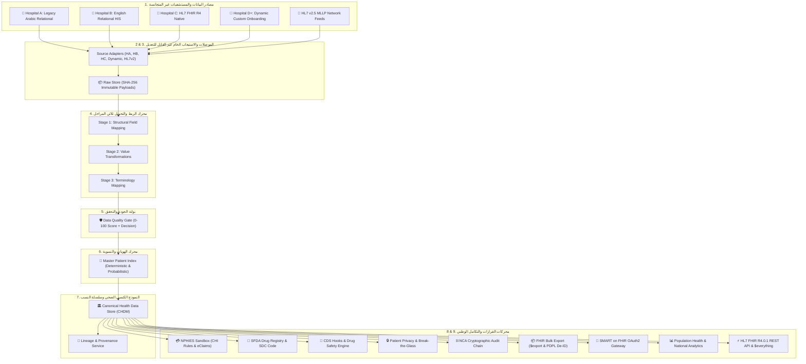

# المنصة الوطنية للربط والتشغيل الصحي البيني
# Saudi National Health Interoperability Platform (v0.2.4)

[](https://nodejs.org)
[](https://www.typescriptlang.org)
[](https://nphies.sa)
[](https://nca.gov.sa)
[](#-الاختبارات-والتحقق-الآلي)
[](#-خريطة-النظام-الحالية)

> **نموذج أولي معماري لمنظومة وطنية متكاملة لمعالجة وتطبيع البيانات الصحية غير المتجانسة** بين مختلف المستشفيات والمراكز الصحية في المملكة العربية السعودية، متوافقة مع معايير **المركز الوطني للمعلومات الصحية (NHIC)، مجلس الضمان الصحي (CHI/NPHIES)، الهيئة العامة للغذاء والدواء (SFDA)، الهيئة الوطنية للأمن السيبراني (NCA)، ومعايير HL7 FHIR R4.0.1 الرسمية**.

---

## 🏛️ البنية المعمارية ذات الطبقات التسع (9-Layer Architecture)



---

## 🌟 المزايا والمكونات الرئيسية للمنصة

1. **النموذج الكنسي الصحي المستقل (Canonical Health Data Model - CHDM)**:
   - الفصل الواضح بين: `Source Models ≠ Canonical Model ≠ FHIR Exchange Model ≠ NPHIES Profiles`.
2. **استيعاب المستشفيات غير المتجانسة (Heterogeneous Ingestion)**:
   - دعم الجداول العلائقية العربية والإنجليزية، ورسائل HL7 v2.5 MLLP، وموارد FHIR R4 الأصلية.
3. **محرك المصطلحات المتعدد (Multi-System Terminology)**:
   - ربط متزامن للمفهوم الطبي مع: **SNOMED CT** السريري، **ICD-10-AM** التشخيصي، **SBS** المالي والتسعيري، و **LOINC** المخبري.
4. **سجل الأدوية والتطعيمات بكود الدواء السعودي (SFDA SDC & MOH Vaccines)**:
   - ربط الأدوية بكود هيئة الغذاء والدواء (`0628500100101 - Glucophage`) وتصنيف ATC، وتتبع لقاحات وزارة الصحة.
5. **محرك مطالبات وتأمين نفيس (NPHIES Sandbox & CHI Rules)**:
   - تطبيق لوائح مجلس الضمان الصحي واحتساب نسب التحمل (20% وبحد أقصى 100 ريال لفئة A) والتسوية الفورية للمطالبات.
6. **دعم القرار السريري ومحاكي الوصفات التجريبية (CDS Hooks Engine)**:
   - فحص استباقي لحظي للتفاعلات الدوائية وموانع الاستعمال الكلوية لمضادات الالتهاب واضطرابات السكر.
7. **الأمن السيبراني وسلسلة التدقيق المشفرة (NCA Cryptographic Audit Chain)**:
   - كتل تدقيق مشفرة بروابط SHA-256 متسلسلة غير قابلة للتلاعب لفحص نزاهة السجلات الطبية.
8. **تصدير البيانات الضخمة للمستودع الوطني (FHIR Bulk Export & PDPL De-ID)**:
   - تصدير بصيغة NDJSON مع محرك تجهيل الهويات للأبحاث والذكاء الاصطناعي الطبي.
9. **بوابة المصادقة والتفويض المعيارية (SMART on FHIR OAuth2)**:
   - تمكين تطبيقات المرضى (مثل تطبيق *صحتي*) وبوابات الأطباء من الوصول المصرح به للملف الموحد.

10. **بوابة المريض التفاعلية المباشرة (Live Patient Portal)**:
    - واجهة أفراد مخصصة للمرضى تتيح الاطلاع اللحظي على السجلات الطبية، نتائج التحاليل، الأدوية الموصوفة، وإدارة موافقات مشاركة البيانات (Consents)، متصلة مباشرة بالخلفية (Backend) وقاعدة البيانات الموحدة لضمان عرض بيانات طبية حقيقية غير وهمية.

---

## 🚀 التشغيل السريع (Quickstart)

### المتطلبات الأساسية:
- Node.js v20+ أو Docker
- PostgreSQL (محلي عبر `docker-compose.yml` أو سحابي عبر `DATABASE_URL`)
- متغيرات البيئة: `DATABASE_URL` و `JWT_SECRET` و `ALLOWED_ORIGIN` (إلزامي في الإنتاج) — انظر `vercel.env` كمثال

### 1. التشغيل المحلي للمطورين:
```bash
# تثبيت الاعتماديات (يولّد Prisma Client تلقائياً عبر postinstall)
npm install

# تهيئة قاعدة البيانات (5 هجرات: init + patient-reported + rbac_hardening + appointment_consent_quad + correction_status)
npx prisma migrate deploy
npx prisma db seed   # أدوار + منظمات + مستخدمون تجريبيون (prisma/seed.ts)

# تشغيل خادم المنصة ولوحة التحكم (REST :3000 + MLLP :2575)
npm run dev
```
🌐 افتح المتصفح على الرابط: **[http://localhost:3000](http://localhost:3000)** (يوجَّه غير المسجَّل إلى `/auth/login.html`)

### 2. تشغيل العرض الحي الشامل عبر الطرفية (14 خطوة معمارية):
```bash
npm run demo
```

### 3. تشغيل اختبارات الضغط والأداء العالي (1,000+ سجل):
```bash
npm run benchmark
```

### 4. التشغيل عبر حاويات Docker:
```bash
docker-compose up -d --build
```

---

## 🧪 الاختبارات والتحقق الآلي

6 ملفات اختبار عبر **Vitest** (إجمالي ~32 اختباراً): `tests/unit/normalization-pipeline.test.ts` (خط الأنابيب: استيعاب 3 مستشفيات، MPI، مصطلحات، SFDA، تطعيمات، NPHIES، ‏$everything‏، مستشفى ديناميكي، CDS، تدقيق وتصدير، HL7 MLLP، SMART) + `tests/unit/baseline-security.test.ts` (‏10 فحوص أمنية) + `tests/unit/hl7-mllp-server.test.ts` + `tests/unit/real-raw-store.test.ts` + `tests/patient-reported-health*.test.ts`.
```bash
npm test
```
> ملاحظة تشغيلية (2026-09-13): البناء `tsc --noEmit` نظيف. الاختبارات التي تلمس PostgreSQL السحابية قد تفشل محلياً بخطأ `too many connections` عند تجاوز حد الاتصالات — أعد المحاولة لاحقاً أو استخدم قاعدة محلية عبر `docker-compose.yml`.

### قياسات الأداء المرجعية (من `npm run benchmark` — بيئة الاختبار الأصلية)
- الاستيعاب والتطبيع: ~15,908 سجل/ثانية — فحص CDS: ~27,328 فحص/ثانية — تصدير Bulk: ~13,223 مورد/ثانية — تحقق سلسلة التدقيق (1000+ كتلة): 100% خلال ~5ms.

---

## 🗺️ خريطة النظام الحالية

- **الكود:** `src/` — ‏92 ملف TypeScript‏ في 22 مجلداً. القلب `src/orchestration/normalization-engine.ts` (~1466 سطر: ingest→validate→map→terminology→MPI→persist→provenance). الدخول `src/api/server.ts` (`createPlatformApp()` — حقن PrismaRawStore/PrismaCanonicalStore/PrismaMpiService/PrismaTerminologyService/PrismaProvenanceService + middlewares: helmet/CSP+nonce/HSTS وCORS وrate-limit وبوابة Vercel) و `api/index.ts` للنشر اللاخادمي.
- **الوحدات:** `src/modules/` — ‏16 وحدة:‏ admin, analytics, audit, cds, clinical, clinical-write, data, fhir, hl7, hospital, nphies, patients, platform, public, security, smart. والمسارات القديمة `src/api/routes/` — ‏7 ملفات:‏ auth, hospital, moh, patient, patient-reported-health, appointments, corrections.
- **قاعدة البيانات:** `prisma/schema.prisma` — ‏44 موديلاً‏ (هوية وصلاحيات: User/Organization/Role/RolePermission/UserPermission + ‏6 أدوار:‏ SYS_ADMIN, MOH_ADMIN, MOH_AUDITOR, HOSPITAL_ADMIN, CLINICIAN, PATIENT و ~33 صلاحية؛ سريري canonical: Patient(+internal_id_uuid)/PatientIdentifier/PatientOrganization/Encounter/Condition/Observation/MedicationRequest/Immunization/Coverage/Claim/ClaimResponse/AllergyIntolerance/DiagnosticReport + ‏correction_status‏؛ مواعيد رباعية Appointment↔Consent؛ تدقيق AuditLog/AuditBlock/DataImport؛ خط الأنابيب RawRecord/InternalPatientIdentity/MpiIdentifier/MatchHistory/DuplicateCandidate/Terminology*/ProvenanceRecord/SmartToken/DynamicHospital/OrganizationChangeRequest؛ مُبلغ ذاتياً 9 موديلات) + ‏5 هجرات‏ (تنتهي بـ `correction_status`).
- **الواجهة:** `public/` — ‏10 ملفات‏ (لوحة `index.html/app.js/style.css` + `js/api-client.js` + بوابة المريض `js/patient-self-reported.js` + `auth/login.html/register.html/auth.js/auth.css`) — التصميم ملزم بمرجع `DESIGN_SYSTEM.md`.
- **النقاط:** ~155 مساراً فعلياً — REST `/api/...` (حوكمة MOH والمستشفيات، مواعيد، تصحيحات، بيانات مُبلغة ذاتياً `/api/patients/me/*`، تحليلات وقاء، NPHIES، CDS، أمن break-glass وسلسلة تدقيق، بيانات raw/mpi/terminology/provenance، كتابة سريرية `/api/clinical/*`) + FHIR R4 `/fhir/...` (metadata, $export, Patient/$everything, :type/$validate, الموارد السريرية والمالية) + SMART `/.well-known/smart-configuration, /oauth/token, /oauth/introspect` + HL7 MLLP على TCP 2575.
- **الأدوار والصلاحيات:** ‏6 أدوار × ~33 صلاحية‏ (`ORG_MANAGE, AUDIT, ANALYTICS, PATIENT_*, CLINICAL_*, CLAIM, IMPORT, CONSENT, BREAK_GLASS, EXPORT, FHIR_*`) — التفاصيل في `prisma/seed.ts` و `src/security/authorization.service.ts`.
- **النشر:** `Dockerfile` (متعدد المراحل + مستخدم غير جذري + فحص `/fhir/metadata`) + `docker-compose.yml` (postgres:15 + المنصة على 3000) + `vercel.json` (كل الحركة إلى `api/index.ts`).

> الخريطة التفصيلية الكاملة (مجلد بمجلد + جدول endpoints): [`docs/SYSTEM_MAP.md`](./docs/SYSTEM_MAP.md).

---

## 📚 الوثائق والمراجع المعمارية

- 🗺️ **[`docs/SYSTEM_MAP.md`](./docs/SYSTEM_MAP.md)**: خريطة النظام الحالية — البنية والمجلدات وجدول الـ endpoints والأدوار (محدَّثة 2026-09-13).
- 📑 **[`WALKTHROUGH.md`](./WALKTHROUGH.md)**: دليل ومراحل الإنجاز الشاملة بالخطوات (المراحل 1 - 11).
- 📐 **[`IMPLEMENTATION_PLAN.md`](./IMPLEMENTATION_PLAN.md)**: وثيقة التصميم المعماري المعتمدة v0.2 (محدَّثة: ما كان مؤجلاً في MVP-Plus أصبح منفذاً).
- 🇸🇦 **[`WHITEPAPER.md`](./WHITEPAPER.md)**: الورقة البيضاء والتقرير التنفيذي لرؤية 2030 والعائد الاستثماري.
- 🎨 **[`DESIGN_SYSTEM.md`](./DESIGN_SYSTEM.md)**: المرجع التصميمي الملزم للواجهة (v0.2.4).
- 📊 **[`PROJECT_STATUS.md`](./PROJECT_STATUS.md)**: حالة المنصة الشاملة الحالية (كانت تقتصر على وحدة المريض — وُحّدت 2026-09-13).
- 🚀 **[`QUICK_START.md`](./QUICK_START.md)**: دليل التشغيل السريع الكامل للمنصة + أمثلة API.
- 🧬 **[`PATIENT_HEALTH_IMPLEMENTATION_REPORT.md`](./PATIENT_HEALTH_IMPLEMENTATION_REPORT.md)** و **[`PATIENT_HEALTH_SUMMARY.md`](./PATIENT_HEALTH_SUMMARY.md)**: توثيق وحدة البيانات المُبلغة ذاتياً.
- 🔧 **[`docs/REFACTOR_PROGRESS.md`](./docs/REFACTOR_PROGRESS.md)** و **[`docs/BEST_PRACTICES_APPLIED.md`](./docs/BEST_PRACTICES_APPLIED.md)** و **[`docs/migration/patient-identity-unification.md`](./docs/migration/patient-identity-unification.md)**: سجل إعادة الهيكلة والترحيلات.

---
*تم تطوير هذا المشروع كنموذج أولي متقدم لمعمارية التشغيل الصحي البيني الوطني في المملكة العربية السعودية.*
