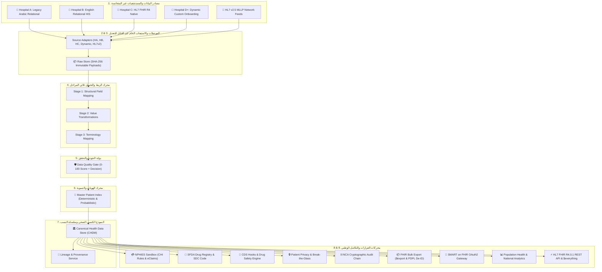

# المنصة الوطنية للربط والتشغيل الصحي البيني
# Saudi National Health Interoperability Platform (v0.2.4)

[](https://nodejs.org)
[](https://www.typescriptlang.org)
[](https://nphies.sa)
[](https://nca.gov.sa)
[-brightgreen.svg)](#-الاختبارات-والتحقق-الآلي)
[](#-قياسات-الأداء-الفائق)

> **نموذج أولي معماري لمنظومة وطنية متكاملة لمعالجة وتطبيع البيانات الصحية غير المتجانسة** بين مختلف المستشفيات والمراكز الصحية في المملكة العربية السعودية، متوافقة مع معايير **المركز الوطني للمعلومات الصحية (NHIC)، مجلس الضمان الصحي (CHI/NPHIES)، الهيئة العامة للغذاء والدواء (SFDA)، الهيئة الوطنية للأمن السيبراني (NCA)، ومعايير HL7 FHIR R4.0.1 الرسمية**.

---

## 🏛️ البنية المعمارية ذات الطبقات التسع (9-Layer Architecture)



---

## 🌟 المزايا والمكونات الرئيسية للمنصة

1. **النموذج الكنسي الصحي المستقل (Canonical Health Data Model - CHDM)**:
   - الفصل الواضح بين: `Source Models ≠ Canonical Model ≠ FHIR Exchange Model ≠ NPHIES Profiles`.
2. **استيعاب المستشفيات غير المتجانسة (Heterogeneous Ingestion)**:
   - دعم الجداول العلائقية العربية والإنجليزية، ورسائل HL7 v2.5 MLLP، وموارد FHIR R4 الأصلية.
3. **محرك المصطلحات المتعدد (Multi-System Terminology)**:
   - ربط متزامن للمفهوم الطبي مع: **SNOMED CT** السريري، **ICD-10-AM** التشخيصي، **SBS** المالي والتسعيري، و **LOINC** المخبري.
4. **سجل الأدوية والتطعيمات بكود الدواء السعودي (SFDA SDC & MOH Vaccines)**:
   - ربط الأدوية بكود هيئة الغذاء والدواء (`0628500100101 - Glucophage`) وتصنيف ATC، وتتبع لقاحات وزارة الصحة.
5. **محرك مطالبات وتأمين نفيس (NPHIES Sandbox & CHI Rules)**:
   - تطبيق لوائح مجلس الضمان الصحي واحتساب نسب التحمل (20% وبحد أقصى 100 ريال لفئة A) والتسوية الفورية للمطالبات.
6. **دعم القرار السريري ومحاكي الوصفات التجريبية (CDS Hooks Engine)**:
   - فحص استباقي لحظي للتفاعلات الدوائية وموانع الاستعمال الكلوية لمضادات الالتهاب واضطرابات السكر.
7. **الأمن السيبراني وسلسلة التدقيق المشفرة (NCA Cryptographic Audit Chain)**:
   - كتل تدقيق مشفرة بروابط SHA-256 متسلسلة غير قابلة للتلاعب لفحص نزاهة السجلات الطبية.
8. **تصدير البيانات الضخمة للمستودع الوطني (FHIR Bulk Export & PDPL De-ID)**:
   - تصدير بصيغة NDJSON مع محرك تجهيل الهويات للأبحاث والذكاء الاصطناعي الطبي.
9. **بوابة المصادقة والتفويض المعيارية (SMART on FHIR OAuth2)**:
   - تمكين تطبيقات المرضى (مثل تطبيق *صحتي*) وبوابات الأطباء من الوصول المصرح به للملف الموحد.

10. **بوابة المريض التفاعلية المباشرة (Live Patient Portal)**:
    - واجهة أفراد مخصصة للمرضى تتيح الاطلاع اللحظي على السجلات الطبية، نتائج التحاليل، الأدوية الموصوفة، وإدارة موافقات مشاركة البيانات (Consents)، متصلة مباشرة بالخلفية (Backend) وقاعدة البيانات الموحدة لضمان عرض بيانات طبية حقيقية غير وهمية.

---

## 🚀 التشغيل السريع (Quickstart)

### المتطلبات الأساسية:
- Node.js v20+ أو Docker

### 1. التشغيل المحلي للمطورين:
```bash
# تثبيت الاعتماديات
npm install

# تشغيل خادم المنصة ولوحة التحكم
npm run dev
```
🌐 افتح المتصفح على الرابط: **[http://localhost:3000](http://localhost:3000)**

### 2. تشغيل العرض الحي الشامل عبر الطرفية (14 خطوة معمارية):
```bash
npm run demo
```

### 3. تشغيل اختبارات الضغط والأداء العالي (1,000+ سجل):
```bash
npm run benchmark
```

### 4. التشغيل عبر حاويات Docker:
```bash
docker-compose up -d --build
```

---

## 🧪 الاختبارات والتحقق الآلي

اجتياز **12 حزمة اختبارات معمارية شاملة** بنجاح 100%:
```bash
npm test
```

```
 ✓ tests/unit/normalization-pipeline.test.ts (12 tests) 50ms
   ✓ 1. Ingestion of raw records from 3 heterogeneous hospital systems
   ✓ 2. Master Patient Index (MPI) identity resolution (100% deterministic & probabilistic)
   ✓ 3. Multi-system terminology mapping (SNOMED, ICD-10-AM, SBS, LOINC)
   ✓ 4. SFDA Saudi Drug Code (SDC) ePrescriptions normalization & ATC
   ✓ 5. Saudi MOH National Immunizations & CVX tracking
   ✓ 6. NPHIES insurance coverage & claims sandbox adjudication with CHI copay rules
   ✓ 7. HL7 FHIR R4.0.1 Longitudinal Patient Bundle ($everything - 25 resources)
   ✓ 8. Dynamic Hospital Onboarding & custom payload normalization
   ✓ 9. Prospective ePrescription CDS Hooks safety checks & interaction alerts
   ✓ 10. Cryptographic Audit Chain integrity (NCA) & FHIR Bulk Export ($export) with PDPL De-ID
   ✓ 11. HL7 v2.5 MLLP Pipe-Delimited ADT A01 Ingestion & Normalization
   ✓ 12. SMART on FHIR OAuth2 Discovery & Scoped Token Authorization
```

---

## 📚 الوثائق والمراجع المعمارية

- 📑 **[`WALKTHROUGH.md`](./WALKTHROUGH.md)**: دليل ومراحل الإنجاز الشاملة بالخطوات (المراحل 1 - 6).
- 📐 **[`IMPLEMENTATION_PLAN.md`](./IMPLEMENTATION_PLAN.md)**: وثيقة التصميم المعماري المعتمدة v0.2.
- 🇸🇦 **[`WHITEPAPER.md`](./WHITEPAPER.md)**: الورقة البيضاء والتقرير التنفيذي لرؤية 2030 والعائد الاستثماري.

---
*تم تطوير هذا المشروع كنموذج أولي متقدم لمعمارية التشغيل الصحي البيني الوطني في المملكة العربية السعودية.*
