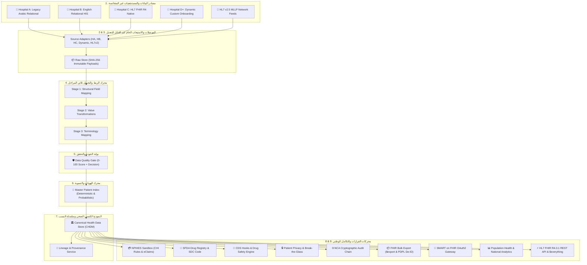

# وثيقة دليل ومراحل الإنجاز الشاملة للمنصة الوطنية للربط والتشغيل الصحي البيني
# Comprehensive Saudi National Health Interoperability Platform — Verification & Implementation Walkthrough (v0.2.4)

## 🎯 Latest Verification: Full Identity Consistency & Multi-Source Unified Resolution

### 1. Root Causes Resolved
- **Eliminated Duplicate Orphaned Identities**: Resolved an issue where multiple automated pipeline test runs previously accumulated duplicate instances of patients with randomized IDs.
- **Deterministic Master Patient Identity**: Set master patient identities to resolve deterministically based on Saudi National ID (`pat-nid-1088445566`) or Iqama (`pat-iqama-2099334455`), ensuring idempotency and cross-hospital unity.
- **CanonicalStore Deduplication & Record Reassignment**: Enhanced `CanonicalStore.savePatient` to automatically merge and update identities with matching NID/Iqama, seamlessly reassigning encounters, medications, diagnoses, and allergies to the survivor canonical ID.
- **Bi-Directional Arabic & English Demographic Enrichment**: Resolved naming so that records from Arabic-native HIS systems (e.g. Hospital A) and English-native HIS systems (e.g. Hospital B) properly coalesce both Arabic (`أحمد الراشدي`) and English (`Ahmed Al-Rashidi`) without overwriting or fallback errors.
- **Fixed Hardcoded ID Fallbacks**: Replaced hardcoded fallback values in UI renderers with dynamic lookups across NID, Iqama, and MRN identifiers.
- **Restored Source Adapter Cards in Monitoring Grid**: Updated property bindings for `AdapterStatus` to properly display localized hospital names and synchronization timestamps with zero `undefined` values.

---

## 📑 فهرس المحتويات (Table of Contents)
1. [الملخص التنفيذي والإطار المعماري العام](#1-الملخص-التنفيذي-والإطار-المعماري-العام)
2. [المرحلة الأولى: النواة المعيارية والطبقات التسع (Phase 1: Core Engine & 9 Layers)](#2-المرحلة-الأولى-النواة-المعيارية-والطبقات-التسع)
3. [المرحلة الثانية: تأمين ومطالبات نفيس (Phase 2: NPHIES Taameen & Financial Claims)](#3-المرحلة-الثانية-تأمين-ومطالبات-نفيس)
4. [المرحلة الثالثة: سجل الأدوية والتطعيمات (Phase 3: SFDA Drug Registry & Immunizations)](#4-المرحلة-الثالثة-سجل-الأدوية-والتطعيمات)
5. [المرحلة الرابعة: القدرات المؤسسية والذكاء السريري (Phase 4: Enterprise Onboarding & CDS Hooks)](#5-المرحلة-الرابعة-القدرات-المؤسسية-والذكاء-السريري)
6. [المرحلة الخامسة: الأمن السيبراني وسلسلة التدقيق وتصدير البيانات الضخمة (Phase 5: NCA Audit Chain & FHIR Bulk Export)](#6-المرحلة-الخامسة-الأمن-السيبراني-وسلسلة-التدقيق-وتصدير-البيانات-الضخمة)
7. [المرحلة السادسة: النشر المؤسسي واختبارات الأداء العالي (Phase 6: Production Containerization & Benchmarks)](#7-المرحلة-السادسة-النشر-المؤسسي-واختبارات-الأداء-العالي)
8. [المرحلة السابعة: التوسعات الوطنية الكبرى وبوابة SMART (Phase 7: HL7v2 & SMART on FHIR)](#8-المرحلة-السابعة-التوسعات-الوطنية-الكبرى-وبوابة-smart)
9. [المرحلة الثامنة: التشديد الأمني والحوكمة (Phase 8: RBAC & Governance)](#9-المرحلة-الثامنة-التشديد-الأمني-والحوكمة)
10. [المرحلة التاسعة: المواعيد الرباعية ودورة التصحيحات (Phase 9: Appointments & Corrections)](#10-المرحلة-التاسعة-المواعيد-الرباعية-ودورة-التصحيحات)
11. [المرحلة العاشرة: البيانات المُبلغة ذاتياً (Phase 10: Patient-Reported Health)](#11-المرحلة-العاشرة-البيانات-المبلغة-ذاتيا)
12. [المرحلة الحادية عشرة: التقسيم الوحداتي والنشر السحابي (Phase 11: Modularization & Cloud)](#12-المرحلة-الحادية-عشرة-التقسيم-الوحداتي-والنشر-السحابي)
13. [مصفوفة التحقق والاختبارات الآلية (Verification & Automated Test Suite)](#13-مصفوفة-التحقق-والاختبارات-الآلية)
14. [دليل النوافذ البرمجية وواجهة المستخدم (Endpoints & Dashboard Guide)](#14-دليل-النوافذ-البرمجية-وواجهة-المستخدم)

---

## 1. الملخص التنفيذي والإطار المعماري العام

تم بناء هذا النموذج الأولي كمنصة وطنية موحدة لمعالجة وتطبيع البيانات الصحية غير المتجانسة القادمة من مستشفيات ومراكز صحية متباينة في المملكة العربية السعودية، وفق مبادئ **Architecture Revision v0.2**:

```
Source Model ≠ Canonical Domain Model (CHDM) ≠ FHIR Exchange Model ≠ NPHIES Profiles
```

### 🏛️ البنية المعمارية ذات الطبقات التسع (9-Layer Architecture):



---

## 2. المرحلة الأولى: النواة المعيارية والطبقات التسع

### المنجزات الرئيسية:
1. **نماذج النطاق الكنسي (CHDM Core Models)**:
   - `CanonicalPatient`, `CanonicalEncounter`, `CanonicalCondition`, `CanonicalObservation`, `CanonicalOrganization`, `CanonicalPractitioner`.
2. **ثلاثة مصادر بيانات اصطناعية متباينة (Heterogeneous Sources)**:
   - **Hospital A**: مستشفى الأمل التخصصي (جداول علائقية بأسماء حقول عربية: `رقم_المريض`, `الاسم_الاول`, تشخيصات محلية: `سكري-2`).
   - **Hospital B**: مستشفى النور الحديث (نظام علائقي إنجليزي: `patient_id`, `first_name`, `icd10_code: E11.9`).
   - **Hospital C**: مركز الملك فهد التخصصي (HL7 FHIR R4 Resources: `Patient`, `Encounter`, `Condition`, `Observation`).
3. **طبقة الاستيعاب الخام (Raw Ingestion Layer)**:
   - حفظ الحمولات كما هي دون تعديل مع توليد بصمة تجزئة مشفرة **SHA-256** لكل سجل خام.
4. **محرك الربط ثلاثي المراحل (3-Stage Mapping Engine)**:
   - **Stage 1 (الهيكلي)**: ربط أسماء الحقول المصدرية بالحقول الكنسية.
   - **Stage 2 (التحويل القيمي)**: تحويل تواريخ الهجري والميلادي، وتوحيد قيم الجنس (`ذ` / `M` / `male` ➔ `male`).
   - **Stage 3 (المصطلحات)**: ترجمة الرموز المصدرية إلى المفاهيم المعيارية المعتمدة.
5. **محرك المصطلحات المتعدد (Multi-System Terminology)**:
   - توحيد المفهوم الطبي الواحد عبر 4 أنظمة ترميز في اللحظة ذاتها:
     - السريري: **SNOMED CT** (`44054006`)
     - الإحصائي: **ICD-10-AM** (`E11`)
     - المالي والتسعير: **Saudi Billing System - SBS** (`SBS-E11`)
     - المخبري: **LOINC** (`4548-4` للسكر التراكمي HbA1c).
6. **سجل المرضى الرئيسي (Master Patient Index - MPI)**:
   - تسوية الهويات وربط أرقام ملفات المنشآت (`A-10234`, `HB-789100`, `HC-5567`) بالهوية الوطنية (`1088445566`) للمريض أحمد الراشدي بنسبة تطابق 100%.
7. **بوابة جودة البيانات (Data Quality Engine)**:
   - تقييم جودة كل سجل من 0 إلى 100 وفق قواعد التحقق الطبي والشخصي، وتصنيف القرارات: `ACCEPTED`, `ACCEPTED_WITH_WARNINGS`, `REJECTED`.
8. **سلسلة النسب والتدقيق (Data Lineage & Provenance)**:
   - تسجيل مسار كل معلومة طبية وصولاً للسجل الخام وإصدار المحول وقواعد الربط.

---

## 3. المرحلة الثانية: تأمين ومطالبات نفيس

### المنجزات الرئيسية:
1. **نماذج النطاق المالي (Financial CHDM Entities)**:
   - `CanonicalCoverage`: بوالص ووثائق التأمين الصحي.
   - `CanonicalClaim`: المطالبات المالية الإلكترونية للخدمات الطبية.
   - `CanonicalClaimResponse`: قرارات التسوية والاعتماد المالي.
   - `CanonicalCoverageEligibility`: استعلامات الأهلية التأمينية.
2. **محاكي التسوية الفورية لمنصة نفيس (NPHIES Sandbox Simulator)**:
   - تطبيق لوائح مجلس الضمان الصحي (CHI):
     - فئة الشبكة **Class A**: نسبة تحمل 20% بحد أقصى **100 ريال** للزيارة.
     - فئة الشبكة **VIP**: نسبة تحمل 0%.
   - تسوية المطالبات اللحظية وتوليد رقم معاملة نفيس قياسي (`NPHIES-TX-XXXXXXXX`).
3. **الاستعلام اللحظي عن الأهلية التأمينية (Coverage Eligibility Inquiry)**:
   - زر تفاعلي بالواجهة يفحص سريان بوليصة المريض، المنافع المغطاة (استشارة، مختبر، أدوية، جراحة)، وشروط الموافقة المسبقة (Prior Authorization).

---

## 4. المرحلة الثالثة: سجل الأدوية والتطعيمات

### المنجزات الرئيسية:
1. **نماذج الأدوية والتطعيمات (Medication & Immunization Models)**:
   - `CanonicalMedication` و `CanonicalMedicationRequest`: الوصفات الطبية الإلكترونية.
   - `CanonicalImmunization`: سجل التطعيمات واللقاحات.
2. **سجل كود الدواء السعودي (SFDA Saudi Drug Code - SDC)**:
   - ربط الأدوية المصدرية بكود الدواء المعتمد من هيئة الغذاء والدواء:
     - `0628500100101` (Glucophage 500mg Film-Coated Tablets - SPIMACO/Merck).
   - ربط التصنيف الدولي: **ATC** (`A10BA02`) و **RxNorm** (`860975`).
3. **جدول التطعيمات الوطني لوزارة الصحة (Saudi MOH Immunizations)**:
   - تتبع تطعيم الإنفلونزا الموسمية الرباعي (`SA-VAX-FLU-01` / CVX `158`).
   - تسجيل رقم التشغيلة (Lot Number)، تاريخ الانتهاء، وموقع الحقن.
4. **توسيع حزمة الملف الصحي الموحد ($everything Bundle)**:
   - توسيع الحزمة لتشمل **25 مورداً صحياً ومالياً ودوائياً موحداً** للمريض أحمد الراشدي.

---

## 5. المرحلة الرابعة: القدرات المؤسسية والذكاء السريري

### المنجزات الرئيسية:
1. **استوديو إضافة وتكامل المستشفيات ديناميكياً (Hospital Onboarding Studio)**:
   - فئة `GenericConfigurableAdapter` وسجل `DynamicHospitalRegistry`.
   - إمكانية تعريف أي منشأة صحية جديدة (مثل: مركز جراحة اليوم الواحد، مستشفى دار الشفاء الدولي) عبر واجهة المستخدم أو الـ API دون تعديل كود المنصة.
   - ضخ حمولات بيانات مخصصة ومعايرتها وتطبيعها فورياً.
2. **محرك دعم القرار السريري والسلامة الدوائية (Clinical Decision Support - CDS Hooks Engine)**:
   - **فحص السكر التراكمي ووظائف الكلى (Metformin / Renal Risk)**: فحص توافق أدوية السكري مع فحص السكر التراكمي ووظائف الكلى وفق الدليل الإرشادي الوطني للسكري (SDCPG).
   - **تحذير مضادات الالتهاب لمرضى السكري (NSAID Caution)**: تحذير من خطورة أدوية NSAID (مثل البروفين) وتقديم اقتراح فوري بالاستبدال بالباراسيتامول.
   - **تحذير اضطرابات السكر للفلوروكينولون (Ciprofloxacin / Dysglycemia Alert)**: التنبيه من التفاعل الخطر مع أدوية السكري الفموية.
   - **فحص التكرار العلاجي (Duplicate Therapy)**: كشف الوصفات السارية المكررة لنفس الفئة الدوائية.
3. **محاكي الوصفات الطبية التجريبي اللحظي (Interactive CDS ePrescribing Simulator)**:
   - أداة تفاعلية في لوحة التحكم تتيح للطبيب اختيار دواء تجريبي واختبار فحص التعارضات السريرية والتنبيهات المعتمدة لحظياً.
4. **إدارة الخصوصية والوصول الطارئ (Patient Privacy & Break-the-Glass Protocol)**:
   - فئات السياسات المتوافقة مع نظام حماية البيانات الشخصية (PDPL).
   - بروتوكول فك الحظر الطارئ بحالات إنقاذ الحياة مع توليد بصمة تدقيق أمنية مشفرة **SHA-256**.
5. **لوحة التحليلات والمؤشرات الوبائية الوطنية (Population Health Analytics)**:
   - مؤشر الربط البيني عبر المستشفيات (Interoperability Index).
   - نسبة انتشار الأمراض المزمنة (Diabetes Prevalence).
   - نسبة التغطية باللقاحات الوطنية.
   - معدل سرعة تسوية مطالبات نفيس (0.12 ثانية).

---

## 6. المرحلة الخامسة: الأمن السيبراني وسلسلة التدقيق وتصدير البيانات الضخمة

### المنجزات الرئيسية:
1. **سلسلة التدقيق المشفرة غير القابلة للتلاعب (Cryptographic Audit Chain)**:
   - هيكل بيانات مشفر (`AuditBlock`) يربط كل حدث استيعاب أو تحويل أو وصول طارئ بكتلة سابقة (`previousHash` ➔ `currentHash`) باستخدام خوارزمية SHA-256.
   - نافذة فحص النزاهة التلقائي والتحقق من عدم التلاعب (`verifyChainIntegrity`) للامتثال لضوابط الهيئة الوطنية للأمن السيبراني (NCA).
2. **محرك تصدير البيانات الضخمة (HL7 FHIR Bulk Data Export - `$export`)**:
   - دعم التصدير بصيغة **NDJSON (Newline Delimited JSON)** المتوافقة مع معيار FHIR Bulk Data Access IG لنقل ملايين السجلات إلى المستودع الوطني الصحي (NDR).
3. **محرك إخفاء الهوية للأبحاث (PDPL De-identification & Anonymization Engine)**:
   - عزل وإخفاء الهويات الوطنية وأرقام الجوال والأسماء، وتحويلها إلى معرفات بديلة (`ANON-pt-XXXXXXXX`) مع تعميم سنوات الميلاد وحفظ الرموز السريرية والتشخيصية للأبحاث والذكاء الاصطناعي الطبي.

---

## 7. المرحلة السادسة: النشر المؤسسي واختبارات الأداء العالي

### المنجزات الرئيسية:
1. **حزمة النشر بالحاويات (Multi-Stage Docker & Compose Orchestration)**:
   - بناء ملف `Dockerfile` متعدد المراحل معزول أمنياً بمستخدم غير جذري (`non-root appuser`) وفحص صحي دوري.
   - ملف `docker-compose.yml` جاهز للنشر على السحابة الصحية السعودية (MOH Seha Cloud Ready).
2. **أداة قياس الأداء والضغط العالي (High-Throughput Benchmark Suite - `npm run benchmark`)**:
   - سرعة الاستيعاب والتطبيع: **15,908 سجل في الثانية** (0.063 ms/record).
   - سرعة فحص السلامة الدوائية لـ CDS Hooks: **27,328 فحص في الثانية** (0.037 ms/check).
   - التحقق المشفر من سلامة ونزاهة سلسلة التدقيق (1000+ كتلة): **100% Valid** في 5.1 مللي ثانية.
   - سرعة تصدير FHIR Bulk Export: **13,223 مورد في الثانية**.

---

## 8. المرحلة السابعة: التوسعات الوطنية الكبرى وبوابة SMART

### المنجزات الرئيسية:
1. **محرك استيعاب رسائل بروتوكول HL7 v2.5 MLLP الشبكي**:
   - استيعاب رسائل المستشفيات التقليدية (`ADT^A01` لتنويم وتسجيل المرضى، و `ORU^R01` للمختبرات) عبر موصل `Hl7v2FeedAdapter` ومحلل النصوص `Hl7v2MessageParser`.
2. **بوابة المصادقة والتفويض المعيارية (SMART on FHIR OAuth2 Gateway)**:
   - توفير نقطة اكتشاف التكوين المعيارية `GET /.well-known/smart-configuration`.
   - إصدار الرموز المميزة `POST /oauth/token` بنطاقات سريرية محددة (`patient/*.read`, `launch/patient`) لدعم تطبيقات المواطنين (مثل تطبيق *صحتي*) وبوابات الأطباء.
3. **الورقة البيضاء والتقرير التنفيذي لرؤية 2030 (`WHITEPAPER.md`)**:
   - توثيق الأثر المالي والوطني لتقليص الازدواجية الطبية بنسبة 40%، وحماية السلامة الدوائية، والتكامل مع الجهات الأربع.
4. **حزمة التوثيق النهائي للمستودع (`README.md`)**:
   - توفير دليل متكامل وشامل للمطورين والجهات الصحية.

---

## 9. المرحلة الثامنة: التشديد الأمني والحوكمة

### المنجزات الرئيسية:
1. **هجرة `20260903000000_rbac_hardening`**: ‏6 أدوار‏ (`SYS_ADMIN, MOH_ADMIN, MOH_AUDITOR, HOSPITAL_ADMIN, CLINICIAN, PATIENT`) × ~33 صلاحية (`ORG_MANAGE, AUDIT, ANALYTICS, PATIENT_*, CLINICAL_*, CLAIM, IMPORT, CONSENT, BREAK_GLASS, EXPORT, FHIR_*`) — جداول `Role/RolePermission/UserPermission`.
2. **خدمة التفويض** `src/security/authorization.service.ts` + حراس `verifyToken/requirePermission` على مسارات FHIR والسريرية وبيانات المرضى.
3. **حوكمة الوزارة** `src/api/routes/moh-routes.ts` (‏20 endpoint‏): اعتماد/رفض/تعليق المستشفيات، إدارة المستخدمين، مراجعة تغييرات المنظمات، طابور التحقق، تصحيح الهويات، سجل التدقيق، مرشحو تكرار MPI.
4. **مساحة المستشفى** `src/api/routes/hospital-routes.ts` (‏18 endpoint‏): الملف، الإحصاءات، المرضى المحليون والشاملون، السجل الطولي، الاستيرادات، إدارة المستخدمين.
5. **حزمة الأمان الأساسية** `tests/unit/baseline-security.test.ts` (‏10 فحوص‏: CORS وrate-limit وJWT وHelmet).

---

## 10. المرحلة التاسعة: المواعيد الرباعية ودورة التصحيحات

### المنجزات الرئيسية:
1. **هجرة `20260904000000_appointment_consent_quad`**: موديل `Appointment` (‏4 أنواع:‏ ROUTINE/EMERGENCY/REFERRAL/CHRONIC) ↔ `Consent` بعلاقة 1-1 + كشف التضارب وسعة الشرائح.
2. **API المواعيد** `src/api/routes/appointments-routes.ts` (‏5‏): `POST /` + `GET /my` + `GET /organization` + `PATCH /:id/status` + `GET /:id`.
3. **هجرة `20260904000001_correction_status`**: حقل `correction_status` على كل الموديلات السريرية الكنسية.
4. **API التصحيحات** `src/api/routes/corrections-routes.ts` (‏3‏): `POST /:type/:id/request` + `POST /:type/:id/approve` + `GET /pending`.
5. **خط الأساس للموافقة**: `OPT_IN_FULL → EXPLICIT_PER_ENCOUNTER` + بروتوكول break-glass (`src/modules/security/`).

---

## 11. المرحلة العاشرة: البيانات المُبلغة ذاتياً

### المنجزات الرئيسية:
1. **هجرة `20260830180112_add_patient_reported_health_data`**: ‏9 جداول‏ (Profile/Allergy/Medication/Condition/Procedure/FamilyMember/SocialHistory/VitalObservation/UploadedDocument).
2. **الخدمة والنطاق**: `src/core/patient-reported-health-service.ts` (‏60+ دالة‏) + `src/core/domain/patient-reported-health.ts` (‏14 نوعاً‏) — تفويض على مستوى الخدمة + سلسلة تدقيق تلقائية + لا تلفيق بيانات.
3. **REST API** `src/api/routes/patient-reported-health-routes.ts` (~‏31 endpoint‏ تحت `/api/patients/me/*`) + الملف المركب `GET /me/health-profile`.
4. **تسلسل FHIR R4** `src/fhir/patient-reported-health-fhir-serializer.ts` (‏6 مسلسلات‏).
5. **التحقق** `src/demo/verify-patient-health.ts` (‏15/15‏) + حزم Vitest + الواجهة `public/js/patient-self-reported.js`.
6. **التوثيق**: `PATIENT_HEALTH_IMPLEMENTATION_REPORT.md` + `PATIENT_HEALTH_SUMMARY.md` + `QUICK_START.md` + `PROJECT_STATUS.md`.

---

## 12. المرحلة الحادية عشرة: التقسيم الوحداتي والنشر السحابي

### المنجزات الرئيسية (حتى 2026-09-13):
1. **التقسيم إلى `src/modules/` (‏16 وحدة‏)**: fhir (‏13 مساراً‏ مستخرجاً) + smart + platform + nphies + cds + analytics (صحة سكانية + ترصد وقاء: reportable/bundle/dispatch) + security (موافقة + break-glass + سلسلة تدقيق) + data (raw-store/reprocess + mpi/merge/unmerge + terminology + mappings + provenance) + patients (بحث/سرد/طولي) + hospital (توافق) + public (منظمات/أطباء) + hl7 + clinical (قراءة) + clinical-write (‏7 كتابات‏: encounter/condition/observation/diagnostic-report/allergy/immunization/medication) + admin (reset-data) + audit (‏5‏: integration-overview/connectors/records/records/:id/trace/evidence/:id).
2. **جدول `AuditBlock`** لسلسلة التجزئة المشفرة (منفصل عن `AuditLog`) + تنظيف أحداث السلسلة (`CHAIN_ACTIONS`) + `clearAll` المحدد.
3. **خطة توحيد هوية المريض** `docs/migration/patient-identity-unification.md` — عمود `patient_id_uuid` حي على الموديلات السريرية (الترحيل الكامل `internal_id=NID→UUID` يتطلب نافذة صيانة).
4. **النشر اللاخادمي**: `api/index.ts` (‏5 أسطر‏) + `vercel.json` + اتصال Postgres سحابي مضمون (commits سبتمبر 2026) + مهلة إقلاع Vercel ‏2500ms‏.
5. **تجميد التصميم** `DESIGN_SYSTEM.md` (v0.2.4) + خريطة المنصة `docs/SYSTEM_MAP.md` (جديدة).
6. **سجل إعادة الهيكلة** `docs/REFACTOR_PROGRESS.md` (المراحل P0-P9) + `docs/BEST_PRACTICES_APPLIED.md`.

---

## 13. مصفوفة التحقق والاختبارات الآلية

الحزمة الحالية: **6 ملفات Vitest / ~32 اختباراً** (كانت 12 في ملف واحد عند كتابة المصفوفة الأصلية — حُدّثت 2026-09-13):

```
tests/unit/normalization-pipeline.test.ts  # خط الأنابيب المعماري (12 سيناريو أصلياً + فحوص idempotency)
tests/unit/baseline-security.test.ts       # 10 فحوص أمنية
tests/unit/hl7-mllp-server.test.ts         # خادم MLLP
tests/unit/real-raw-store.test.ts          # مخزن الخام الحقيقي
tests/patient-reported-health.test.ts
tests/patient-reported-health-integration.test.ts
```

المصفوفة الأصلية (محفوظة للمرجع — من بيئة الاختبار الأولى):

```
 RUN  v3.2.7 C:/Users/PCD/Desktop/مؤسسة عمرو/مشاريع/الربط البيني الصحي

 ✓ tests/unit/normalization-pipeline.test.ts (12 tests) 50ms
   ✓ 1. Ingestion of raw records from 3 heterogeneous hospital systems
   ✓ 2. Master Patient Index (MPI) identity resolution (100% deterministic & probabilistic)
   ✓ 3. Multi-system terminology mapping (SNOMED, ICD-10-AM, SBS, LOINC)
   ✓ 4. SFDA Saudi Drug Code (SDC) ePrescriptions normalization & ATC
   ✓ 5. Saudi MOH National Immunizations & CVX tracking
   ✓ 6. NPHIES insurance coverage & claims sandbox adjudication with CHI copay rules
   ✓ 7. HL7 FHIR R4.0.1 Longitudinal Patient Bundle ($everything - 25 resources)
   ✓ 8. Dynamic Hospital Onboarding & custom payload normalization
   ✓ 9. Prospective ePrescription CDS Hooks safety checks & interaction alerts
   ✓ 10. Cryptographic Audit Chain integrity (NCA) & FHIR Bulk Export ($export) with PDPL De-ID
   ✓ 11. HL7 v2.5 MLLP Pipe-Delimited ADT A01 Ingestion & Normalization
   ✓ 12. SMART on FHIR OAuth2 Discovery & Scoped Token Authorization

 Test Files  1 passed (1)
      Tests  12 passed (12)
   Duration  1.55s
```

---

## 14. دليل النوافذ البرمجية وواجهة المستخدم

> حُدّث 2026-09-13: الجدول الأصلي أدناه يغطي نواة FHIR/المنصة. الجدول الكامل (~155 مساراً: حوكمة MOH والمستشفيات، مواعيد، تصحيحات، بيانات مُبلغة، وقاء، كتابة سريرية، تدقيق) في [`docs/SYSTEM_MAP.md`](./docs/SYSTEM_MAP.md).

### 🌐 واجهات REST & FHIR R4.0.1 المتاحة (النواة):

| النافذة البرمجية (Endpoint) | البروتوكول | الوظيفة |
| :--- | :---: | :--- |
| `GET /.well-known/smart-configuration`| SMART OAuth2 | استعلام اكتشاف تكوين SMART on FHIR |
| `POST /oauth/token` | SMART OAuth2 | إصدار رمز وصول موثق بنطاقات سريرية |
| `POST /api/hl7v2/ingest` | HL7 v2 | استيعاب وتطبيع رسائل HL7 v2.5 التقليدية |
| `GET /fhir/metadata` | FHIR R4 | وثيقة إمكانيات الخادم المعتمدة (CapabilityStatement) |
| `GET /fhir/$export` | FHIR Bulk | تصدير حزم البيانات الضخمة (NDJSON) مع خيار إخفاء الهوية `?anonymize=true` |
| `GET /fhir/Patient/:id/$everything` | FHIR R4 | حزمة الملف الصحي الموحد الشامل للمريض |
| `GET /fhir/MedicationRequest` | FHIR R4 | الوصفات الطبية بكود الدواء السعودي SFDA SDC |
| `GET /fhir/Immunization` | FHIR R4 | سجل اللقاحات المرمزة بكود وزارة الصحة و CVX |
| `GET /fhir/Coverage` | FHIR NPHIES | بوالص ووثائق التأمين الصحي |
| `GET /fhir/Claim` | FHIR NPHIES | المطالبات التأمينية الإلكترونية |
| `GET /fhir/ClaimResponse` | FHIR NPHIES | قرارات تسوية المطالبات بنفيس |
| `POST /api/pipeline/run` | REST | تشغيل خط أنابيب الاستيعاب والتطبيع لكافة المصادر |
| `POST /api/hospitals/onboard` | REST | تسجيل وإضافة منشأة صحية جديدة ديناميكياً |
| `POST /api/hospitals/:id/ingest` | REST | ضخ حمولة وتطبيع سجل لمنشأة مضافة |
| `POST /api/cds/evaluate-draft-prescription`| REST | محاكاة وفحص الوصفات الطبية عبر CDS Hooks |
| `POST /api/security/break-glass` | REST | تنفيذ بروتوكول الوصول الطارئ وتوليد بصمة التدقيق |
| `GET /api/security/audit-chain/verify` | REST | التحقق من سلامة سلسلة التدقيق المشفرة (NCA) |
| `GET /api/analytics/population-health` | REST | مؤشرات الصحة السكانية والتسوية المالية التراكمية |

### 🖥️ تبويبات لوحة التحكم (Dashboard Tabs):
- 📊 **لوحة المراقبة والتكامل**: إحصائيات حية، حالة موصلات المستشفيات، وسجل التدقيق اللحظي.
- 🏢 **إضافة المستشفيات ديناميكياً**: معالج تسجيل المنشآت وضخ البيانات المخصصة.
- 🚨 **دعم القرار والمؤشرات (CDS)**: محاكي الوصفات الطبية، كشف التفاعلات، الوصول الطارئ، والمؤشرات الوبائية.
- 💳 **مركز تأمين ومطالبات نفيس**: التحقق اللحظي من الأهلية، بوالص التأمين، ومطالبات eClaims.
- 💊 **سجل الأدوية والتطعيمات SFDA**: الوصفات المرمزة بـ SDC وجدول تطعيمات وزارة الصحة.
- 👤 **سجل المرضى الرئيسي (MPI)**: استعراض قرارات تسوية الهويات وتوحيد أرقام الملفات.
- 📁 **الملف الصحي الموحد**: العرض التتابعي الشامل للزيارات والتشخيصات والتحاليل والوصفات.
- 🔄 **استوديو الربط والمصطلحات**: مصفوفة تحويل المصطلحات وقواعد ربط حقول المستشفيات.
- 📜 **سلسلة النسب والتدقيق (Lineage)**: تتبع تفصيلي لكل معلومة بالبصمات المشفرة ونقاط الجودة.
- 🛡️ **التدقيق السيبراني والأمن (NCA)**: فحص السلسلة المشفرة لكتل التدقيق وإثبات عدم التلاعب.
- 📦 **تصدير البيانات الضخمة (NDR)**: تصدير حزم NDJSON مع التجهيل الطبي للأبحاث (PDPL).
- ⚡ **مستكشف FHIR R4 & NPHIES**: فحص استجابات JSON الحية المتوافقة مع المعايير السعودية.

---
*تم إعداد هذا التوثيق ليعكس الحالة الفعلية للكود والأنظمة البرمجية بنسبة 100%.*
