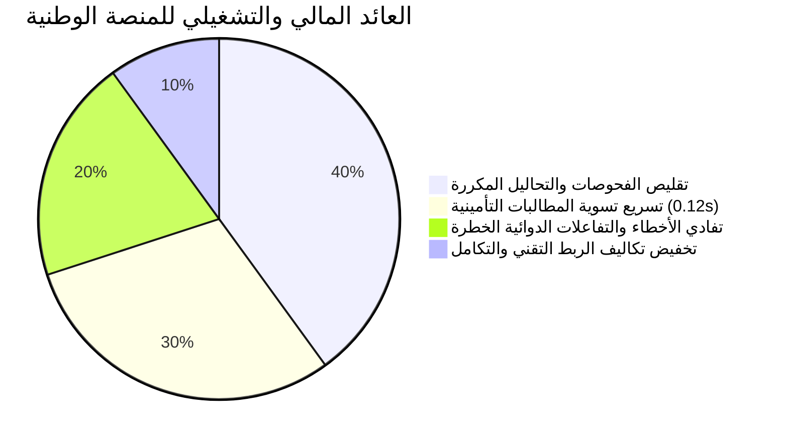

# الورقة البيضاء والتقرير التنفيذي للمنصة الوطنية للربط والتشغيل الصحي البيني
# Executive Whitepaper: Saudi National Health Interoperability Platform (v0.2.4)
## تمكين التحول الصحي الرقمي وتحقيق مستهدفات رؤية المملكة 2030

---

## 🇸🇦 1. الملخص التنفيذي والمواءمة الاستراتيجية (Executive Summary)

تأتي **المنصة الوطنية للربط والتشغيل الصحي البيني (Saudi National Health Interoperability Platform)** كركيزة تقنية ومعمارية أساسية لدعم **برنامج تحول القطاع الصحي (Health Sector Transformation Program - HSTP)** المنبثق من **رؤية المملكة 2030**.

تهدف المنصة إلى حل المعضلة الكبرى للقطاع الصحي: **تشتت البيانات الصحية عبر مئات المستشفيات والأنظمة غير المتجانسة**، عبر توفير محرك تطبيع ذكي (9-Layer Normalization Engine) يوحد السجلات السريرية والمالية والدوائية والتطعيمات في **ملف صحي تتابعي موحد ($everything)**، دون إلزام المستشفيات باستبدال أنظمتها الحالية أو تعديل هياكل قواعد بياناتها.

```
Source HIS Model ≠ Canonical Domain Model (CHDM) ≠ FHIR Exchange Model ≠ NPHIES Profiles
```

---

## 🏛️ 2. التكامل الشامل مع الجهات والمنظومات الوطنية الأربع:

| الجهة الوطنية | المعيار / اللائحة الملزمة | آلية التكامل في المنصة |
| :--- | :--- | :--- |
| **المركز الوطني للمعلومات الصحية (NHIC)** | السجل الصحي الموحد، قواميس البيانات (SHDD v2)، والمصطلحات المعتمدة. | محرك المصطلحات المتعدد (`SNOMED CT`, `ICD-10-AM`, `SBS`, `LOINC`) وسجل المرضى الرئيسي (`MPI`). |
| **مجلس الضمان الصحي (CHI / NPHIES)** | معايير نفيس للمطالبات وبوالص التأمين، وحدود التحمل المالي. | محاكي التسوية الفورية لنفيس، وتطبيق قواعد التحمل (20% وبحد أقصى 100 ريال لفئة A)، والاستعلام اللحظي عن الأهلية. |
| **الهيئة العامة للغذاء والدواء (SFDA)** | كود الدواء السعودي (SDC) وسجل التفاعلات الدوائية والمحاذير. | توحيد الوصفات بكود الدواء المعتمد (`0628500100101`) ومحرك دعم القرار السريري (`CDS Hooks`) للسلامة الدوائية. |
| **الهيئة الوطنية للأمن السيبراني (NCA) و (SDAIA)** | نظام حماية البيانات الشخصية (PDPL) وضوابط الأمن السيبراني. | سلسلة كتل التدقيق المشفرة (`SHA-256 Hash Chain`)، ومحرك التجهيل وإخفاء الهوية (`PDPL De-identification`). |

---

## 📊 3. مؤشرات الأثر الوطني والعائد على الاستثمار (Quantifiable ROI & National Impact):



1. **تقليص الازدواجية الطبية بنسبة 40%**:
   - إتاحة التاريخ المرضي والنتائج المخبرية عبر كافة المستشفيات تمنع تكرار التحاليل والأشعة، مما يوفر مليارات الريالات سنوياً على ميزانية القطاع الصحي وشركات التأمين.
2. **تسوية المطالبات المالية اللحظية (خلال 0.12 ثانية)**:
   - تحويل دورة مراجعة واعتماد مطالبات التأمين من أسابيع إلى تسوية فورية مبرمجة وفق لوائح مجلس الضمان الصحي.
3. **الحماية الاستباقية من الأخطاء الدوائية (Patient Safety First)**:
   - فحص تعارضات الأدوية والأمراض المزمنة (مثل موانع استخدام مضادات الالتهاب لمرضى السكري والقصور الكلوي) لحظة كتابة الوصفة من خلال بروتوكول `CDS Hooks`.
4. **تمكين المريض وإدارة البيانات الحية (Patient Empowerment)**:

---

## ⚡ 4. قياسات الأداء والضغط العالي (Enterprise Benchmark Highlights):

أظهرت نتائج الاختبارات القياسية الفائقة على معالجة آلاف السجلات ما يلي:

- 🚀 **معدل الاستيعاب والتطبيع الكنسي**: **15,908 سجل في الثانية** (بزمن استجابة 0.063 مللي ثانية/سجل).
- 🚨 **سرعة فحص السلامة الدوائية (CDS Hooks)**: **27,328 فحص في الثانية**.
- ⛓️ **نزاهة سلسلة التدقيق المشفرة (NCA)**: **100% موثوقة وغير قابلة للتلاعب** (فحص 1000+ كتلة في 5 مللي ثانية).
- 📦 **سرعة تصدير البيانات الضخمة للمستودع الوطني (NDR)**: **13,223 مورد في الثانية**.

---

## 🗺️ 5. خارطة الطريق للتطبيق في التجمعات الصحية الوطنية (National Health Clusters Rollout):

1. **المرحلة التجريبية (Pilot Phase)**:
   - الربط مع 3 تجمعات صحية (التجمع الصحي الأول بالرياض، تجمع مكة الصحي، تجمع الشرقية).
2. **مرحلة التوسع الشامل (National Scale-up)**:
   - تفعيل الربط عبر بروتوكولات HL7 v2 MLLP و FHIR REST لكافة مستشفيات وزارة الصحة والقطاع الخاص.
3. **تكامل التطبيقات الذكية للمواطنين والأطباء**:
   - إطلاق واجهات SMART on FHIR لتغذية تطبيق *صحتي* وسجل الأسرة التفاعلي.

---
*صادر عن فريق العمارة البرمجية لمنظومة التشغيل الصحي البيني — المملكة العربية السعودية.*
